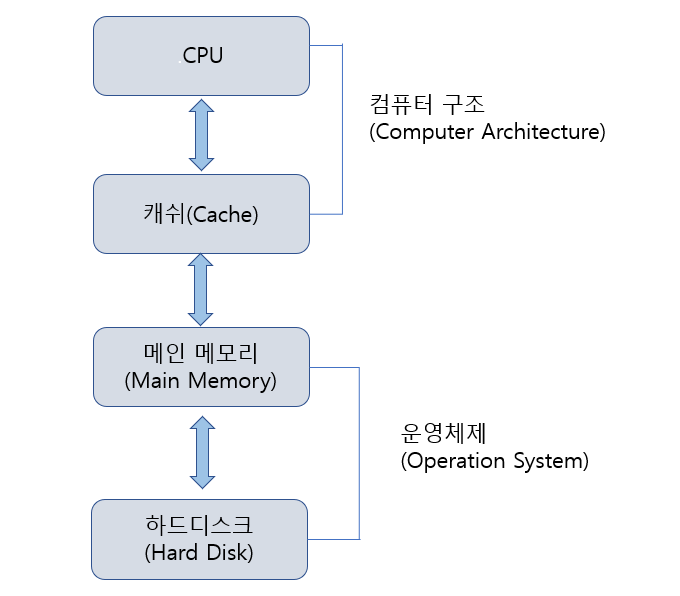
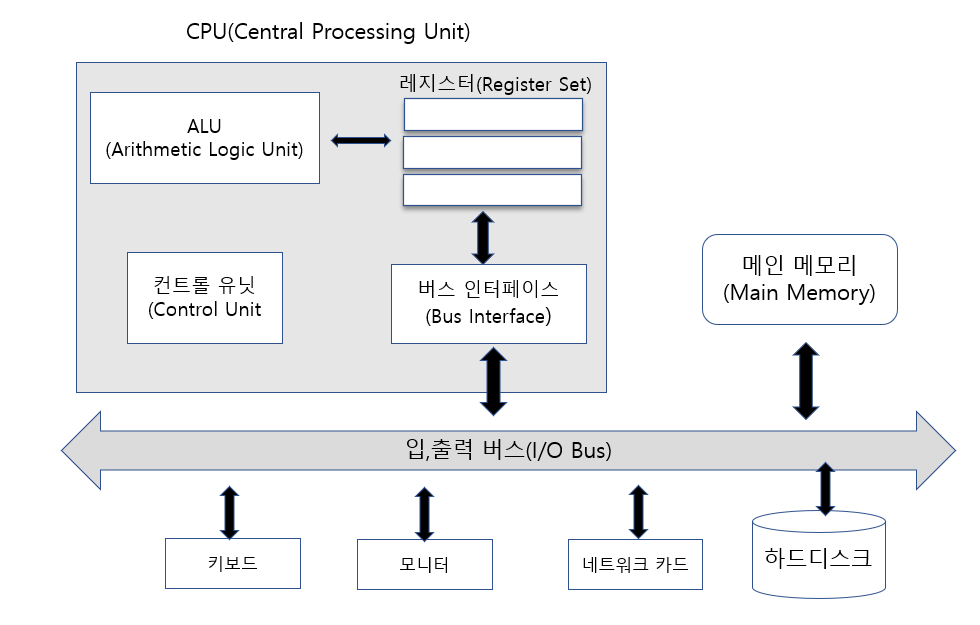
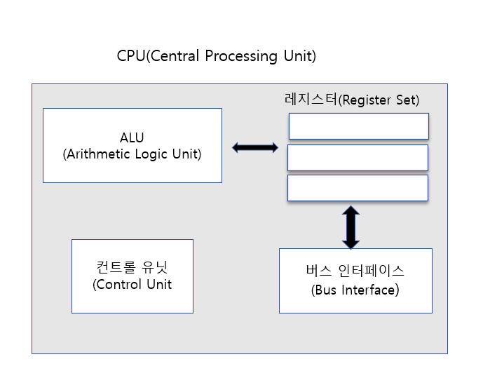
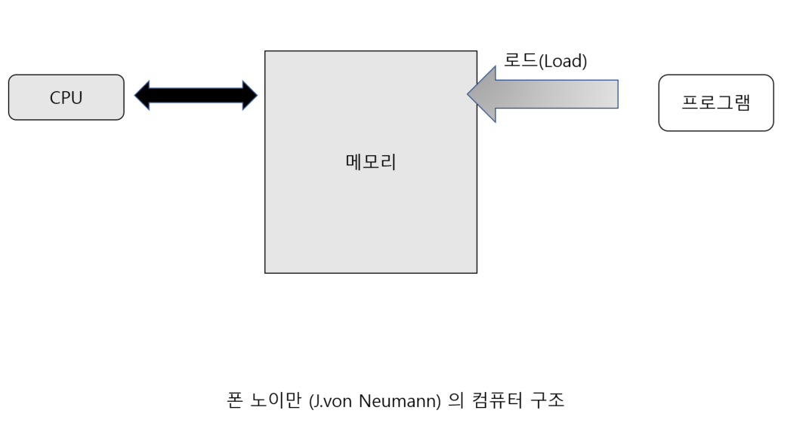
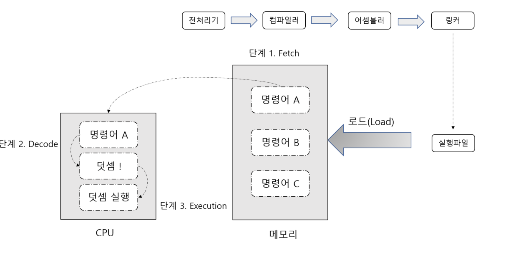
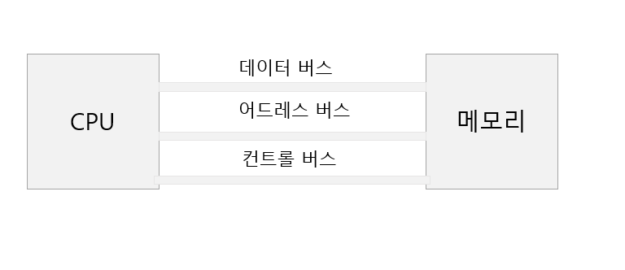

#  컴퓨터 구조에 대한 첫 번째 이야기

## Section02 -  시스템 프로그래밍의 이해와 접근

### 시스템 프로그래밍 이란?

컴퓨터 시스템을 동작시키는 프로그램

즉, 컴퓨터를 동작시키기 위해 필요한 프로그램을 말한다. 

### 컴퓨터 시스템의 주요 구성요소

## Section03 - 컴퓨터 하드웨어의 구성

### CPU(Central Processing Unit)

우리가 흔히 말하는 "중앙처리장치"가 바로 CPU 이다. 

### 메인 메모리(Main Memory)

램(RAM) 이라는 저장장치로 구성되는 메인 메모리는 컴파일이 완료된 프로그램 코드가
올라가서 실행되는 영역 
즉, 메인 메모리는 프로그램 실행을 위해 존재하는 메모리라고 생각하면 된다.

### 입,출력 버스(Input/Output Bus)

입.출력 버스는 컴퓨터를 구성하는 구성요소 사이에서 데이터를 주고 받기 위해 사용되는
경로이다. 주고 받는 데이터의 종류와 역할에 따라서 어드레스 버스(Address Bus) , 
데이터 버스(Data Bus) , 컨트롤 버스(Control Bus) 이렇게 세 가지로 구분이 된다.

## Section 03 - CPU에 대한 이해

### ALU(Arithmetic Logic Unit)

- CPU 내부에는 실제 연산을 담당하는 ALU 라는 블록이 있다.
- ALU 가 처리하는 기본적인 연산은 크게 두 가지로 나뉜다.
- 덧셈이나 뺄셈과 같은 산술 연산
- AND 나 OR 와 같은 논리 연산

### 컨트롤 유닛(Control Unit)

프로그래머가 작성한 프로그램을 컴파일하면 실행파일이 생성된다. 이 실행파일에는 CPU에게
일을 시키기 위한 명령어들이 저장되어 있다. 어떤 경로를 거치던 간에 이 명령어가
CPU 내부로 흘러 들어가야 CPU 에게 일을 시킬 수 있다.

CPU 내부에 있는 ALU 까지 명령어가 전송되었는데 ,사실 ALU 는 명령어를 이해하지 못한다.
산술 연산과 논리 연산만 할 줄 알기 때문이다. 
따라서 ALU 대신에 명령어를 해석해줘야 하는 데 그게 바로 컨트롤 유닛이다.

컨트롤 유닛이 하는 일은 CPU가 처리해야 할 명령어들을 해석하는 것이다.
CPU 내부로 흘러 들어오는 명령어를 보고선 다음과 같은 결정을 내린다. 

"아하 이 명령어는 덧셈을 하라는 뜻이군! 그렇다면 ALU에게 덧셈을 하도록 신호를 보내줘야 겠다."

이처럼 컨트롤 유닛은 명령어를 해석하고, 그 해석된 결과에 따라 적절한 신홀르 CPU의 다른 블록에
보내는 일을 한다. CPU의 총 사령관 정도로 생각하면 되겠다.

### CPU 내부에 존재하는 레지스터들(Register Set)
명령어는 컨트롤 유닛으로 피연산자는 ALU 로 보내면 된다.
그런데 만약, ALU는 연산 중이고 컨트롤 유닛은 앞서 들어온 명령어를 해석하고 있는 상황이라면
이것이 불가능할 수도 있다. 그래서 이보다는 컨트롤 유닛이나 ALU가 필요로 하는 명령어 및
데이터들을 어디엔가 저장해 두고 상황이 허락될 때 직접 가져가도록 하면 좋을 것이다.

다시 말해 CPU 내부에도 임시적으로 데이터를 저장하기 위한 조그마한 메모리 공간이 필요하다는 뜻이다.
다행이도 이러한 메모리가 CPU에 존재한다. 

레지스터(Register)라는 아주 작은 메모리가 CPU 내에 존재한다.
레지스터란 CPU 내부에 존재하는 2진 데이터 저장을 위한 저장장치이다.
크기가 큰 메인 메모리나 하드디스크와 달리, CPU에 따라서 16비트,32비트,64비트 정도의 데이터를
저장 할 수 있는 크기로 구성된다. 

이러한 레지스터들은 CPU 내부에 여러 개가 존재하는 데 CPU의 종류에 따라서 그 개수와 형태가
다양하다. 레지스터들은 각각의 용도가 정해져 있는 것이 일반적이며 이들은 CPU가  연산을 하기 위해서
반드시 필요하다. 아주  기본적인 레지스터만 해도 8개가 넘는다.

### 버스 인터페이스 (Bus Interface)
명령어와 데이터들이 CPU 안으로 잘 흘러들어갔다고 가정해보면
이것이 가능한 이유는 버스 인터페이스가 있기 때문이다.

컴퓨터에는 CPU , 하드디스크 , RAM , 사운드 카드, 그래픽 카드 등이 있는데
이들은 서로 독립적으로 동작하는 것이 아니라 서로 데이터를 주고 받으면서 동작한다. 
그렇다면 서로 데이터를 주고 받기 위해서는 어떠한 매개체가 있어야 하는데 
그것이 바로 I/O 버스 이다.

## Section 04- 프로그램의 실행 과정

### 위대한 수학자 폰 노이만

초창기 컴퓨터는 임의의 연산을 하고자 할 때마다 여러 명의 엔지니어가 달라 붙어서
진공관 회로의 스위치를 변경해 줘야 했다.

폰 노이만은 프로그램이 컴퓨터 내부에 저장되는 구조를 생각해 낸 것이다. 

### 프로그램의 실행 과정

- **단계 1. Fetch** : 메모리 상에 존재하는 명령어를 CPU로 가져오는 작업
- **단계 2. Decode** : 가져다 놓은 명령어를 CPU가 해석하는 단계
- **단계 3. Execution** : 해석된 명령어의 명령대로 CPU가 실행하는 단계

##  Section 05 - 하드웨어의 구성의 재접근

### 데이터 이동의 기반이 되는 버스 시스템

데이터를 이동하는 데 있어서 사용되는 전송 경로를 버스 시스템 이라 한다.

버스 시스템은 주고 받는 데이터의 종류에 따라서
어드레스 버스(Address Bus) ,
데이터 버스(Data Bus) , 컨트롤 버스(Control Bus) 이렇게 세 가지로 구분이 된다.

메인 메모리에 저장되어 있는 명령어들을 가져오는 연산(Fetch) 에 대해서만 언급했지만,
역으로 CPU의 레지스터에 저장되어 있는 데이터를 메인 메모리에 저장하는 일들도 발생한다.

- 데이터 버스 : 데이터를 이동하기 위해 필요한 버스이다.
- 어드레스 버스 : 주소값을 이동하기 위해 필요한 버스이다. 그렇다면 왜 주소값을 이동해야 할까?
CPU가 0x1024 번지에 저장되어 있는 데이터 4바이트를 읽으려고 한다고 가정해보자 
그렇다면 메모리 영역에 주소값 0x1024를 먼저 전달해야 한다. (메모리를 단순히 저장만 하는 바보로
생각하지 말고, 주소가 전달되면 해당 주소의 데이터를 전송하는 컨트롤러가 포함되어 있는 것으로 생각하자)
이때 사용되는 것이 어드레스 버스이다. 메모리는 0x1024 번지에 존재하는 4바이트 데이터를 
데이터 버스를 통해서 전달받게 된다.
- 컨트롤 버스 : CPU가 원하는 바를 메모리에 전달할 때 사용된다. 
