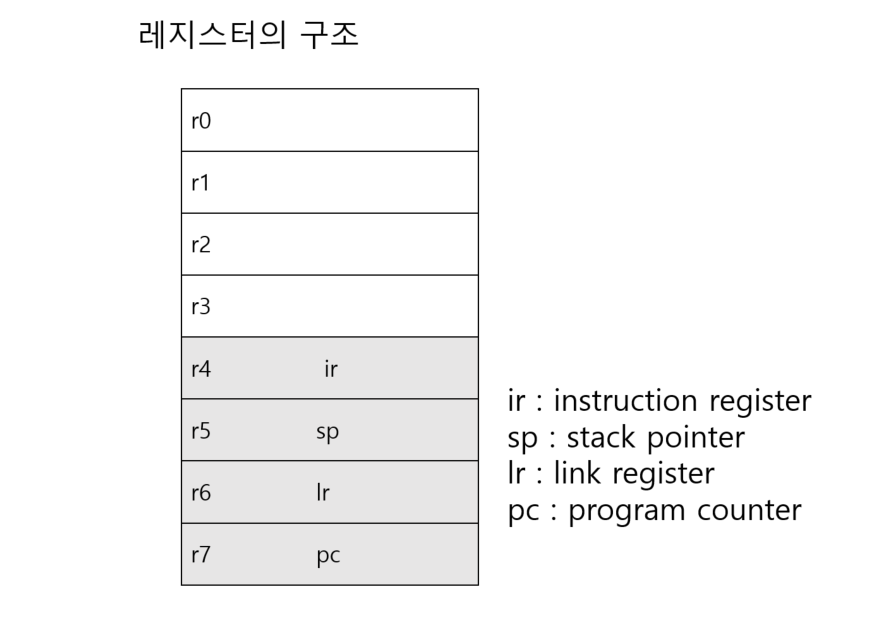
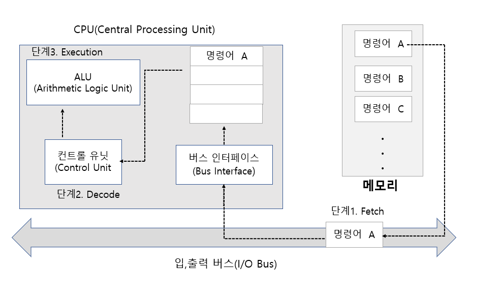
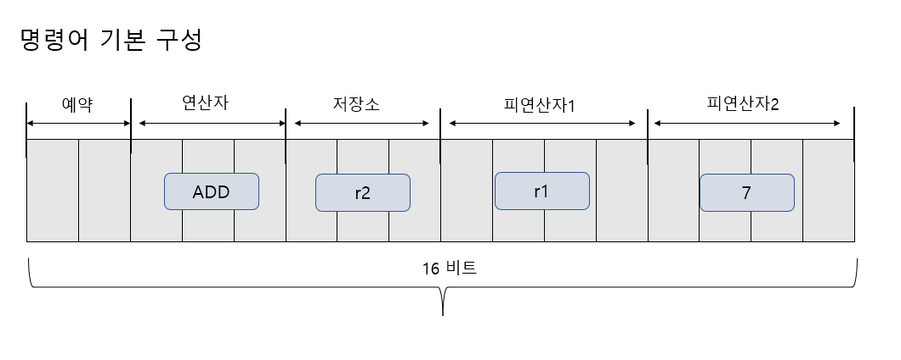
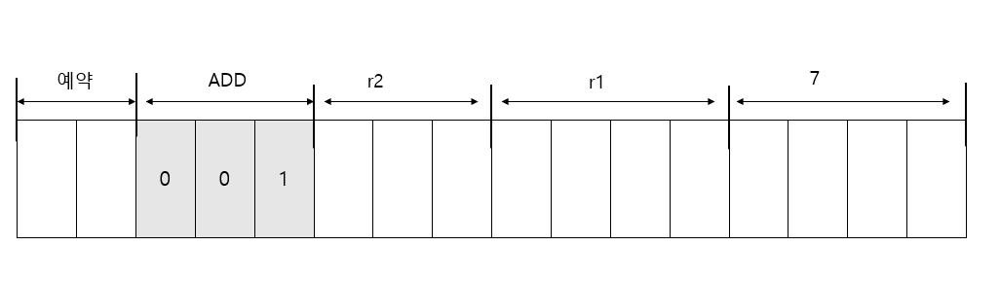
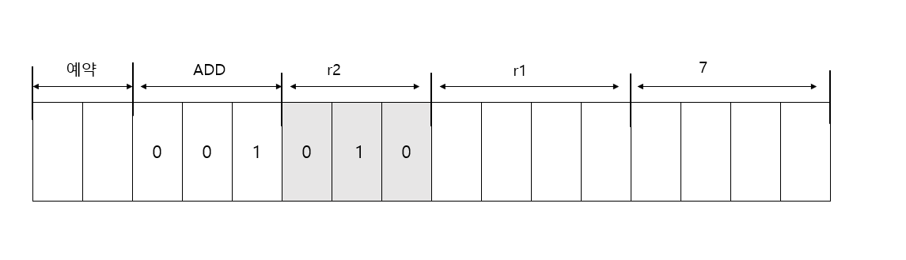
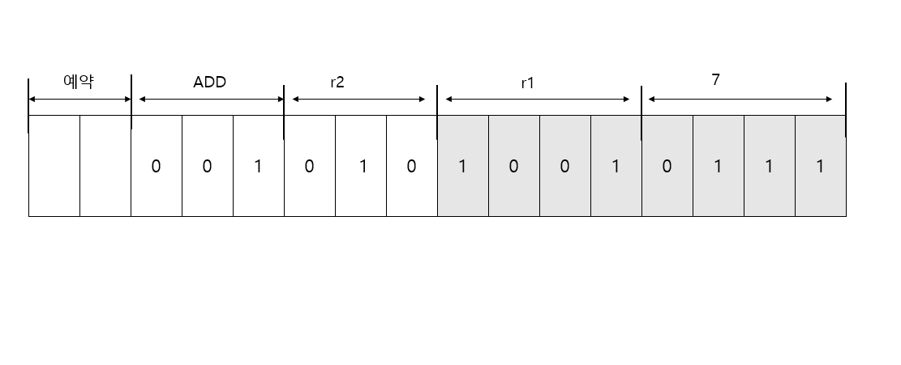
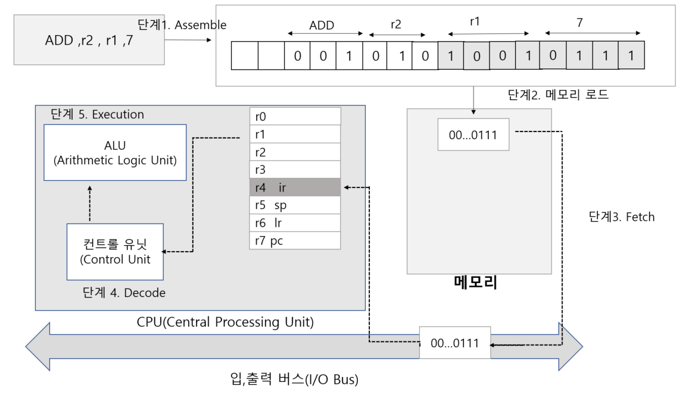

# 컴퓨터 구조의 접근 방법

## 컴퓨터를 디자인하자

- 레지스터만을 디자인 대상으로 삼자
- ALU 와 컨트롤 유닛은 이미 존재한다고 가정
- CPU를 보는 관점 대부분이 레지스터에 집중된다. 
- CPU 디자인에 있어서 레지스터에 대한 이해는 아주 중요하다.

## 레지스터를 디자인 하자

- 레지스터를 몇 비트로 구성할 것인가?
- 몇 개 정도로 레지스터를 구성할 것인가?
- 레지스터 각각을 무슨 용도로 사용할 것인가?

레지스터의 이름은 r0 ~ r7 이다.
r4, r5,r6,r7 은 ir , sp ,lr ,pc 라는 또 다른 이름을 지니도록 했다.
이 네 개의 레지스터들을 특수한 목적으로 사용하기 위해서 이다.

## 명령어 구조 및 명령어를 디자인하자

- ADD 연산자 뒤에 세 개의 비트에는 연산 결과를 저장할 저장소 정보를 둠
- 이곳에는 항상 연산 결과를 저장할 레지스터 정보만 올 수 있게 제한하자.
- 연산에 대한 정보는 세 개의 비트만 할당했기 때문에 우리가 만들어 낼 수 있는 연산자는 최대 8개다

일단 덧셈 , 뺄셈 , 곱셈 , 그리고 나눗셈을 먼저 정의하자.
더불어 어셈블리 프로그래밍을 할 때 사용되는 심볼(Symbol) 도 결정을 하자.

|연산의 의미 | 심볼 | 2진 코드
:---| :---| :---|
|덧셈 | ADD | 001
|뺄셈 | SUB | 010
|곱셈 | MUL | 011
|나눗셈 | DIV | 100 |

각각의 레지스터를 나타내는 2진 코드는 다음과 같이 구성해보자

|레지스터 심볼 | 2진 코드 |
:------|:-------|
|r0 | 000|
|r1 | 010|
|r2 | 010|
|r3 | 011|
|r4 , ir| 100|
|r5 , sp| 101|
|r6 , lr | 110|
|r7 ,pc | 111|

r2 는 연산 결과를 저장한다. 따라서

- r2 = r1 + r3  레지스터 r1 과 r3에 있는 값을 더해서 r2에 저장하라
- r2 = r1 + 4  레지스터 r1 과 숫자 4를 더해서 r2에 저장하라

그런데 저장된 데이터가 숫자를 표현하는 것인지, 레지스터 정보를 표현하는 것인지 구분할 수 있어야 한다.
예를 들어, 0001 이 들어 있다면 이것이 레지스터  r1을 의미하는지, 숫자 1을 의미하는지
알수가 없다.

이 문제를 해결하기 위해 또 하나의 비트를 희생해야 한다.
네 개의 비트 중 첫 번째 비트가 1이면 레지스터 정보를 담고 있는 것이고
, 0이면 숫자 정보를 담은 것으로 약속하자

### 시나리오 구현 예시

- 어셈블리 언어 기반의 프로그램 구현

ADD r2 , r1 ,7

이를 CPU 가 인식할 수 있는 하나의 2진 명령어 형태로 변환
- 어셈블러에 의한 바이너리 코드 생성

0000101010010111

이 명령어가 컨트롤 유닛으로 전달되어 그 의미가 해석되면, 컨트롤 유닛은
CPU의 각 모듈에 명령을 내리게 된다. 그리고 CPU 각 모듈은 이 명령에 따라
적절한 연산을 진행한다.

명령어가 ir(instruction Register) 에 저장되고 있다.

이처럼 ir 은 다음 번에 실행하게 될 명령어를 미리 가져다 놓는 용도로 사용된다.

