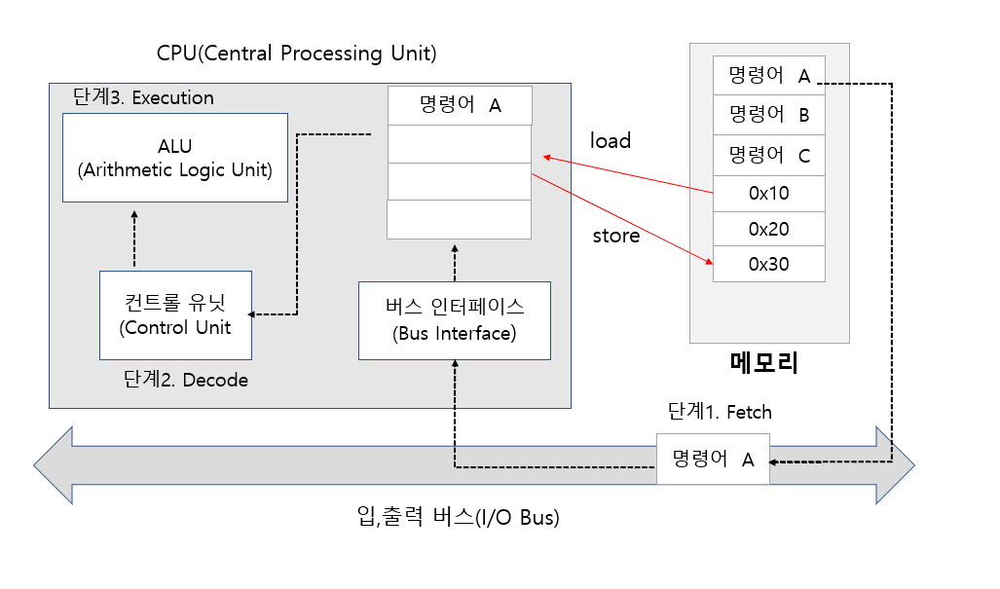
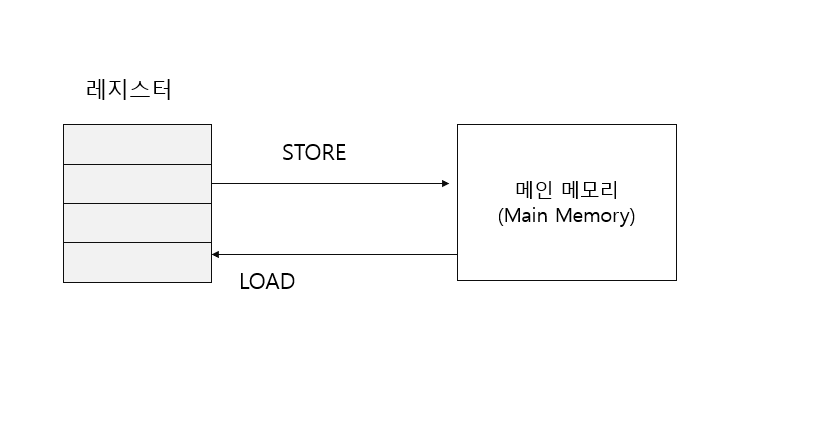
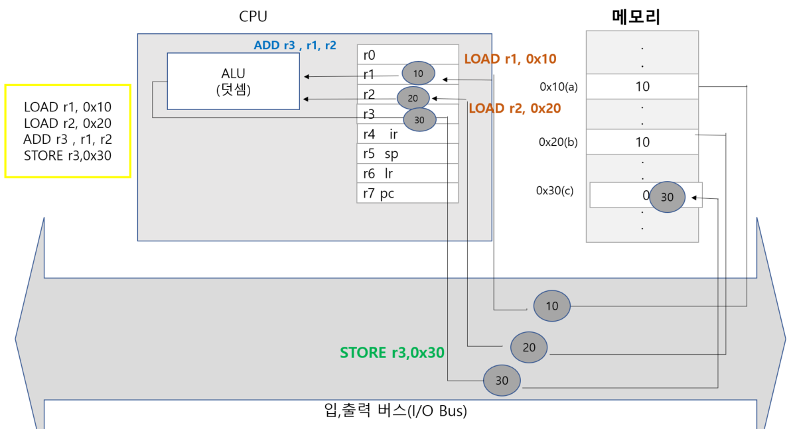

# LOAD & STORE 명령어 디자인

## LOAD & STORE 명령어의 필요성

- 명령어를 디자인 하는 과정에서 사칙 연산 결과를 레지스터에만 저장할 수 있게 제약 사항을 둠
- 즉, 피연산자로 올 수 있는 것은 숫자와 레지스터임

그래서 다음과 같은 연산을 할 수 가 없다.
```c
int a = 10; // 0x10 번지 할당
int b = 20; // 0x20 번지 할당
int c = 0; // 0x30 번지 할당
c = a + b;
```

여기서 c = a+ b 연산을 실행하기 위해서

다음과 같은 명령어로 문장을 구성 해야 한다.

`"0x10번지(a)에 저장된 값과 , 0x20 번지 (b)에 저장된 값을 더해서 0x30 번지(c)에 저장해라`

하지만 메인 메모리 주소 정보를 사칙 연산의 피연산자로 올 수 있도록 명령어 구조를 설계하지 않았다.
( RISC (Reduced Instruction Set Computer) 방식 )

왜?? 메모리 주소가 오게 할 수 있지만 명령어 구조가 복잡해지고 이에 따라 하드웨어 구성도 복잡해지기 때문에
성능이 저하 될 수 있다. 

CISC (Complex Instriction Set Computer) 방식이면 가능하다.

따라서 메인 메모리에 저장된 데이터를 레지스터로 일단 옮겨다 놓은 다음에
덧셈을 진행해야 한다. 레지스터와 메인 메모리 사이에서 데이터를 전송할 수 있는 명령어가 필요하다.




메인 메모리에 저장된 데이터를 레지스터로 이동시키기 위한 LOAD 명령어와,
레지스터에 저장된 데이터를 메인 메모리로 이동시키기 위한 위한 STORE 명령어가 필요하다.




```asm
LOAD r1 , 0x10    // 0x10 번지에 존재하는 데이터를 레지스터 r3에 저장하라
LOAD r2 , 0x20   //0x20 번지에 존재하는 데이터르 레지스터 r2에 저장하라
ADD r3 , r1 ,r2   // r1 , r2에 저장된 값을 더해서 r3에 결과를 저장해라
STORE r3, 0x30   // r3에 저장된 값을 0x30번지에 저장해라
```

