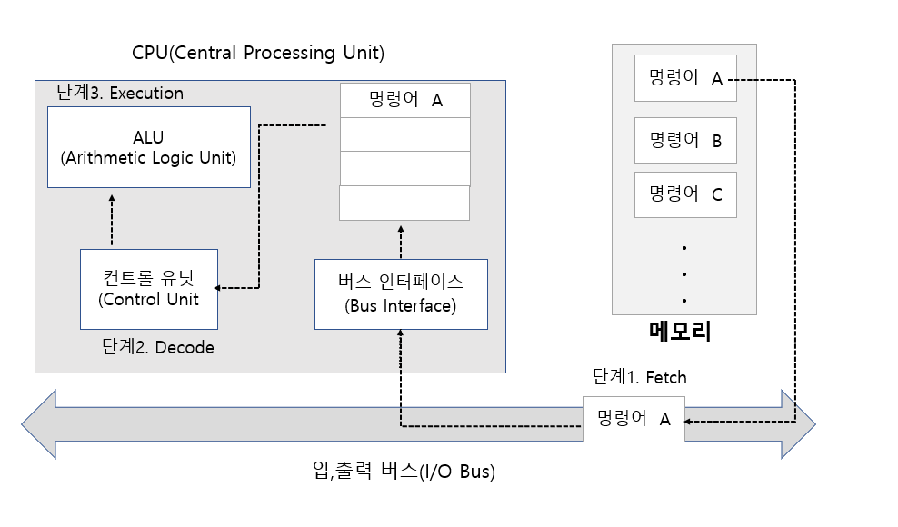
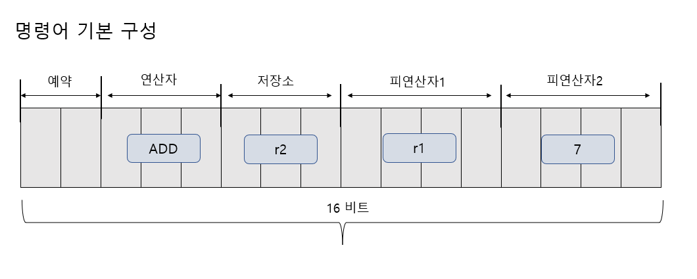
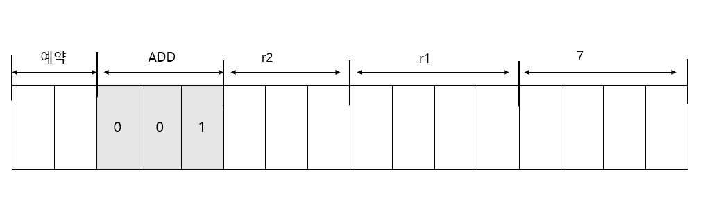
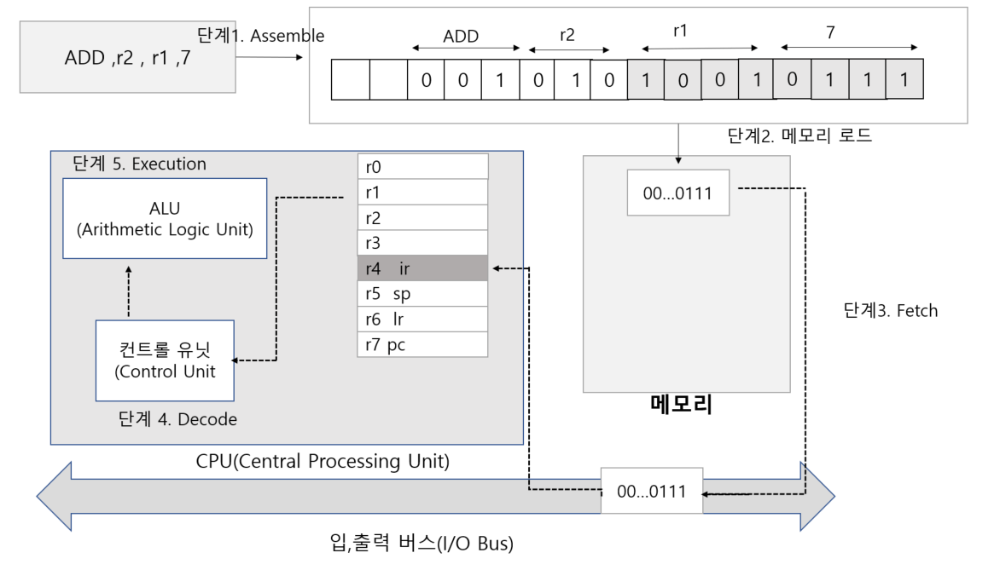
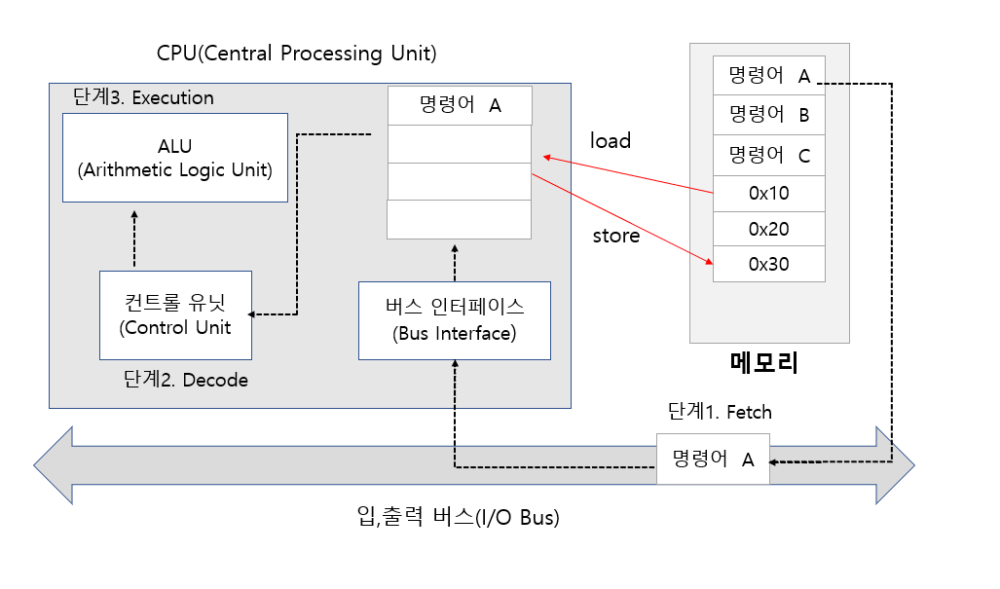
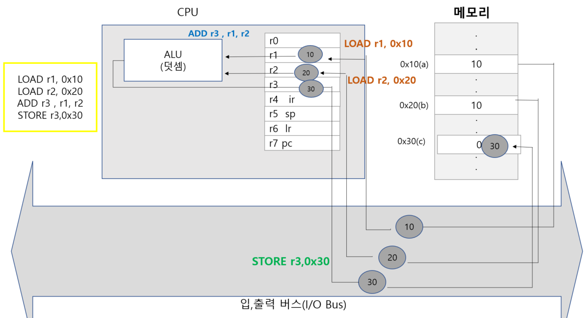
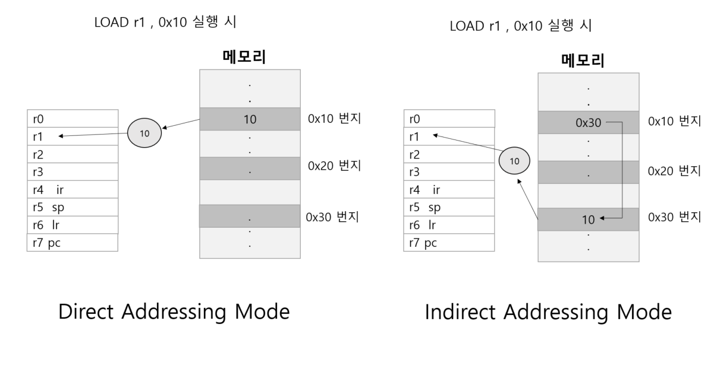

# 컴퓨터 구조에 대한 두 번째 이야기

## 컴퓨터 구조의 접근 방법

### 컴퓨터를 디자인하자

정확히 말해서 디자인할 요소는 CPU이다.
그렇다고 해서 CPU 전부를 논리-게이트 단위로
디자인하자는 것은 물론 아니다. 
1장을 통해서 CPU를 구성하는 기본적인 요소는 ALU ,
컨트롤 유닛 그리고 레지스터임을 알게 되었다.
우리는 이중에서 레지스터만을 디자인 대상으로 삼을 것이다.

- 레지스터만을 디자인 대상으로 삼자
- ALU 와 컨트롤 유닛은 이미 존재한다고 가정
- CPU를 보는 관점 대부분이 레지스터에 집중된다.
- CPU 디자인에 있어서 레지스터에 대한 이해는 아주 중요하다.

### 레지스터를 디자인 하자

- 레지스터를 몇 비트로 구성할 것인가?
- 몇 개 정도로 레지스터를 구성할 것인가?
- 레지스터 각각을 무슨 용도로 사용할 것인가?

만약에 구성하고자 하는 컴퓨터가
64비트 컴퓨터라면 레지스터들도 64비트로 디자인해야겠지만,
공부하는 입장에서 64비트 시스템은 부담스럽다.
따라서 16비트로 디자인하겠다. 
그리고 레지스터 개수도 8개로 제한하겠다. 
레지스터 이름은 r0부터 r7 로 할 것이다. 


레지스터의 이름은 r0 ~ r7 이다.
r4, r5,r6,r7 은 ir , sp ,lr ,pc 라는 또 다른 이름을 지니도록 했다.
이 네 개의 레지스터들을 특수한 목적으로 사용하기 위해서 이다.




### 명령어 구조 및 명령어를 디자인하자

레지스터를 디자인하였으니, 이제는 CPU에게 일을 시키기 위한
명령어 구조 및 명령어 종류를 디자인할 차례이다. 

여기서 주목할 것은 레지스터와 명령어의 상관 관계이다. 
위 문장을 정확히 이해하였다면, CPU 구성 형태에 
따라서 명령어 구조가 달라진다는 것을 쉽게 알아차렸을 것이다. 

이처럼 CPU가 달라지면 이에 따른 명령어 구조가 달라지기 때문에,
어셈블리 언어로 구현된 프로그램은 구조가 다른 CPU로 이식이 불가능하다.



- ADD 연산자 뒤에 세 개의 비트에는 연산 결과를 저장할 저장소 정보를 둠
- 이곳에는 항상 연산 결과를 저장할 레지스터 정보만 올 수 있게 제한하자.
- 연산에 대한 정보는 세 개의 비트만 할당했기 때문에 우리가 만들어 낼 수 있는 연산자는 최대 8개다

일단 덧셈 , 뺄셈 , 곱셈 , 그리고 나눗셈을 먼저 정의하자.
더불어 어셈블리 프로그래밍을 할 때 사용되는 심볼(Symbol) 도 결정을 하자.

|연산의 의미 | 심볼 | 2진 코드
:---| :---| :---|
|덧셈 | ADD | 001
|뺄셈 | SUB | 010
|곱셈 | MUL | 011
|나눗셈 | DIV | 100 |



각각의 레지스터를 나타내는 2진 코드는 다음과 같이 구성해보자

|레지스터 심볼 | 2진 코드 |
:------|:-------|
|r0 | 000|
|r1 | 010|
|r2 | 010|
|r3 | 011|
|r4 , ir| 100|
|r5 , sp| 101|
|r6 , lr | 110|
|r7 ,pc | 111|


r2 는 연산 결과를 저장한다. 따라서

- r2 = r1 + r3  레지스터 r1 과 r3에 있는 값을 더해서 r2에 저장하라
- r2 = r1 + 4  레지스터 r1 과 숫자 4를 더해서 r2에 저장하라

그런데 저장된 데이터가 숫자를 표현하는 것인지, 레지스터 정보를 표현하는 것인지 구분할 수 있어야 한다.
예를 들어, 0001 이 들어 있다면 이것이 레지스터  r1을 의미하는지, 숫자 1을 의미하는지
알수가 없다.

이 문제를 해결하기 위해 또 하나의 비트를 희생해야 한다.
네 개의 비트 중 첫 번째 비트가 1이면 레지스터 정보를 담고 있는 것이고
, 0이면 숫자 정보를 담은 것으로 약속하자


### 시나리오 구현 예시

- 어셈블리 언어 기반의 프로그램 구현

ADD r2 , r1 ,7

이를 CPU 가 인식할 수 있는 하나의 2진 명령어 형태로 변환
- 어셈블러에 의한 바이너리 코드 생성

0000101010010111

이 명령어가 컨트롤 유닛으로 전달되어 그 의미가 해석되면, 컨트롤 유닛은
CPU의 각 모듈에 명령을 내리게 된다. 그리고 CPU 각 모듈은 이 명령에 따라
적절한 연산을 진행한다.



명령어가 ir(instruction Register) 에 저장되고 있다.

이처럼 ir 은 다음 번에 실행하게 될 명령어를 미리 가져다 놓는 용도로 사용된다.


#### `RISC vs CISC`

명령어 종류가 많고, 다양한 조합이 가능한 CPU도 있다. 명령어 개수가 세 자리 수를 넘지 않은
CPU 도 있고 수 백개의 명령어 구성이 가능한 CPU도 있다.

명령어 종류가 많으면 (다양한 조합이 가능) 프로그램을 구현하는 데 편리함을 가져다 준다.
수십 줄에 걸쳐서 구현해야 하는 기능을 단 한 줄로 완성시킬 수 있고 필요에 따라서
명령어 길이도 유동적이기 때문에 메모리를 효율적으로 사용할 수 있다.

이것은 CISC 구조 CPU의 특징이다.
CISC 는 "Complex Instruction Set Computer" 의 약자로 복잡한 명령어체계를 가지는
컴퓨러를 의미한다.  CISC는 명령어 수가 많고 그 크기가 일정치 않기 때문에 CPU 가 복잡해질 수 밖에 없다.
이러한 복잡한 구조는 성능 향상에 제한이 따른다. 보다 높은 성능의 CPU를 디자인하기 위해서
보다 단순한 CPU 구조가 필요하다.


## LOAD & STORE 명령어 디자인

### LOAD & STORE 명령어의 필요성

- 명령어를 디자인 하는 과정에서 사칙 연산 결과를 레지스터에만 저장할 수 있게 제약 사항을 둠
- 즉, 피연산자로 올 수 있는 것은 숫자와 레지스터임

그래서 다음과 같은 연산을 할 수 가 없다.
```c
int a = 10; // 0x10 번지 할당
int b = 20; // 0x20 번지 할당
int c = 0; // 0x30 번지 할당
c = a + b;
```

여기서 c = a+ b 연산을 실행하기 위해서

다음과 같은 명령어로 문장을 구성 해야 한다.

`"0x10번지(a)에 저장된 값과 , 0x20 번지 (b)에 저장된 값을 더해서 0x30 번지(c)에 저장해라`

하지만 메인 메모리 주소 정보를 사칙 연산의 피연산자로 올 수 있도록 명령어 구조를 설계하지 않았다.
( RISC (Reduced Instruction Set Computer) 방식 )

왜?? 메모리 주소가 오게 할 수 있지만 명령어 구조가 복잡해지고 이에 따라 하드웨어 구성도 복잡해지기 때문에
성능이 저하 될 수 있다.

CISC (Complex Instriction Set Computer) 방식이면 가능하다.

따라서 메인 메모리에 저장된 데이터를 레지스터로 일단 옮겨다 놓은 다음에
덧셈을 진행해야 한다. 레지스터와 메인 메모리 사이에서 데이터를 전송할 수 있는 명령어가 필요하다.




메인 메모리에 저장된 데이터를 레지스터로 이동시키기 위한 LOAD 명령어와,
레지스터에 저장된 데이터를 메인 메모리로 이동시키기 위한 위한 STORE 명령어가 필요하다.


### LOAD & STORE 명령어의 디자인

메인 메모리에 존재하는 데이터를 레지스터로 이동시키는 명령어에 대해
LOAD라는 심볼을 붙여주고, 다음고 같이 디자인하자. 

```asm
LOAD r1 , 0x10    // 0x10 번지에 존재하는 데이터를 레지스터 r3에 저장하라
LOAD r2 , 0x20   //0x20 번지에 존재하는 데이터르 레지스터 r2에 저장하라
ADD r3 , r1 ,r2   // r1 , r2에 저장된 값을 더해서 r3에 결과를 저장해라
STORE r3, 0x30   // r3에 저장된 값을 0x30번지에 저장해라
```

덧셈 연산의 피연산자는 숫자이거나 레지스터가 되어야 한다고 정의했기
때문에 우리가 지금 골치를 썩고 있는 것이다. 
그렇다면 무엇이 해결책이겠는가? 피연산자가 레지스터가 되게끔
하기 위해서 메모리에 저장된 값을 레지스터에 옮겨다 놓은 후 
덧셈 연산을 하면 된다.




## Direct 모드와 Indirect 모드

### Direct 모드의 문제점과 Indirect 모드의 제안

하나의 명령어에 여러 정보를 담다 보니 표현하는 데이터 킄기에
제한이 따른다는 문제점이 등장하였다.

지금까지 우리가 언급한 메모리 접근방법을 가리켜 Direct 모드라 하는데,
이 방법을 통해서는 메모리의 모든 영역에 대한 접근이 불가능하다.
왜냐하면 Direct 모드로 메모리를 접근할 경우,
할당 된 비트 수 안에서 표현 가능한 범위의 메모리 영역만 접근이
가능하기 때문이다.


주소값을 명령어에 직접 표현하기 때문에 Direct 모드라 한다.
여기서 우리는 이러한 Direct 모드가 지니고 있는 
단점을 해결하기 위해서 Indirect 모드라는 것을
등장시키기로 결정하겠다.


### Indirect 모드의 이해


앞에서의 LOAD 명령어에서는 레지스터에 저장할 데이터가
존재하는 주소를 직접적으로 표현하였는데, 
반대로 Indirect 모드라 한다면 명령어에서 지정하는
번지에 저장된 값을 주소값으로 참조하게 된다.




