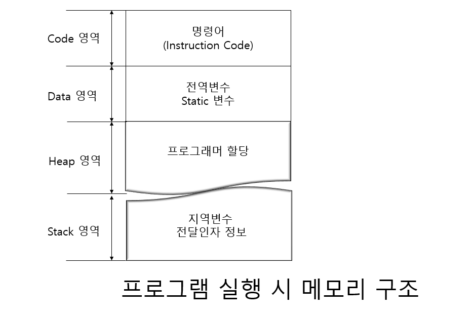
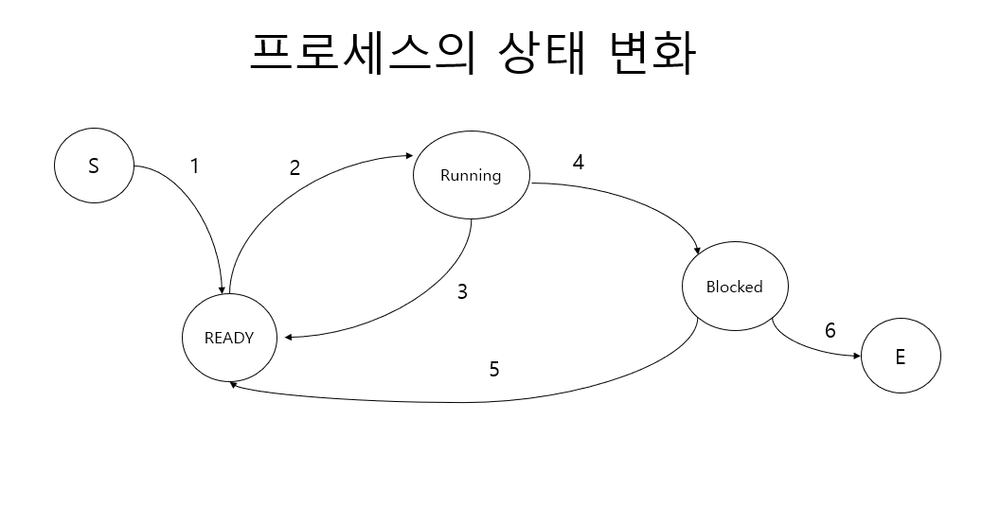
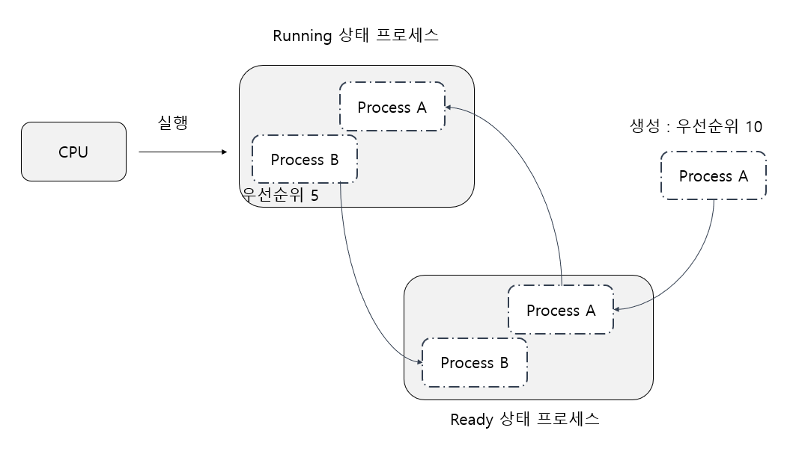
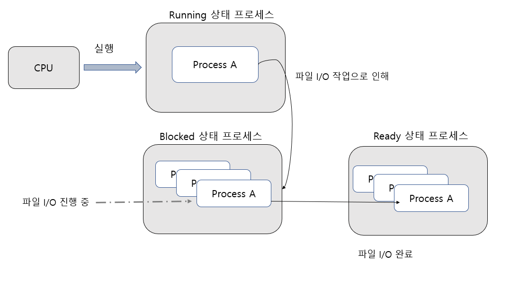
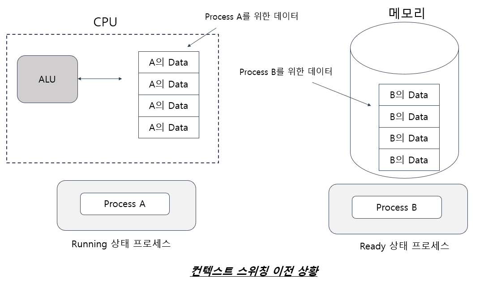
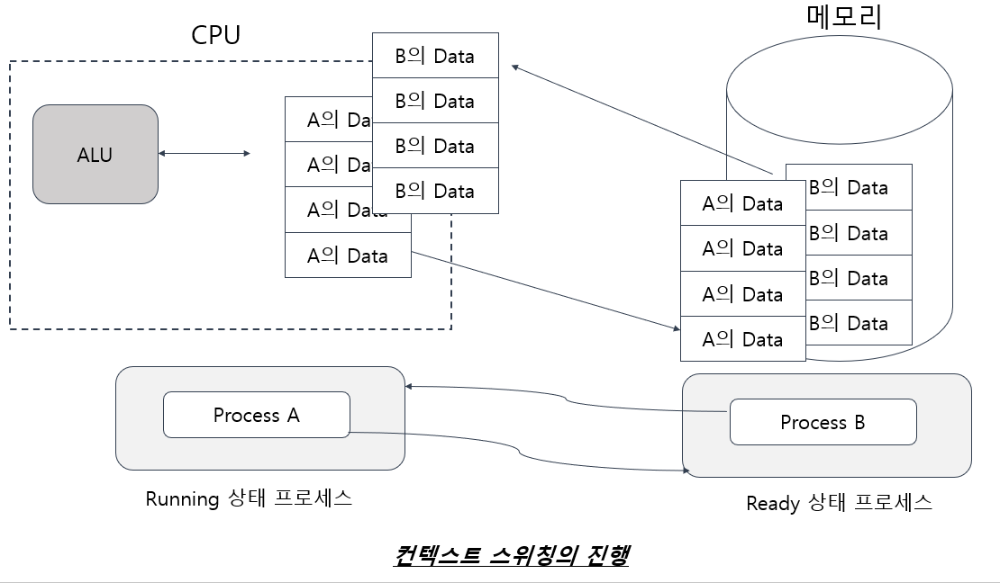

# 프로세스(Process)의 이해

## 프로세스란 무엇인가?

- 프로세스란 메인 메모리로 이동하여 실행 중인 프로그램을 의미한다.  

## 프로세스의 범위

- 메모리 구조 + 레지스터 Set
- 프로세스 별 독립적인 대상은 프로세스의 범주에 포함시킬 수 있다.

프로세스 생성 시 만들어지는 메모리 구조

프로세스 생성 시 만들어 지는 메모리 자체를 프로세스라고 표현하기도 한다. 
왜냐하면 프로그램 실행을 위해서 명령어들이 메모리 공간에 올라와 있는 상태이고,
프로그램 실행을 위해서 필요한 메모리 공간이 할당되어 있는 상태이기 때문이다.

위와 같은 메모리 구조는 실행되고 있는 프로세스 개수 만큼 생성된다. 

### Resister Set
프로그램 실행을 위해서는 CPU 내에 존재하는 레지스터들이 절대적으로 필요하다.

CPU를 구성하는 레지스터들은 프로그램 실행을 위해 필요한 데이터들로 채워지게 된다.
따라서 레지스터들의 상태까지도 프로세스의 일부로 포함시켜 말할 수 있다.

# 프로세스의 스케줄링과 상태 변화

## 프로세스의 스케줄링(Scheduling)

CPU 는 하나인데, 여러 프로세스가 실행된다. 
그 이유는 하나의 CPU가 여러 개의 프로세스를 번갈아 가면서 실행하기 때문이다.

결국 우리가 사용하는 멀티 프로세스 운영체제 에서 여러 개의 프로세스가 실행 되는 것 처럼
보이는 이유는 여러 개의 프로세스들이 CPU 할당 시간을 나누기 때문이다.

### 스케줄링의 기본 원리 

A,B,C 라는 이름의 프로세스 3개가 동시에 실행되어야 한다고 가정해보자 어떠한 기준으로
CPU를 할당해줘야 하겠는가 ? 가장 쉽게 생각 해 볼 수 있는 것은 공평하게
순서대로 돌아가면서 정해진 시간만큼만 CPU를 할당 받는 것이다. 

### `스케줄링`
프로세스의 CPU 할당 순서 및 방법을 결정 짓는 일을 가리켜 스케줄링 이라 한다.

이때 사용되는 알고리즘을 스케줄링 알고리즘이라고 한다.
또한 스케줄링 알고리즘을 적용해서 실제로 프로세스를 관리하는 운영체제 요소(모듈)를 가리켜
스케줄러라고 한다.

### 멀티 프로세스는 CPU를 바쁘게 한다.

우리가 실행해야 할 프로세스 A,B,C 가 있다고 가정해보자
이 프로세스들이 실행되는 형태를 다음과 같이 두 가지로 나눠서 생각 해보자.

1. 아주 고전적인 방식

A 프로세스를 먼저 실행시킨다. A 프로세스가 완전히 종료되고 나면, B 프로세스를 실행시킨다.
B 프로세스도 완전히 종료된다. 그리고 나서야 C 프로세스를 실행시킨다. 즉 우리는
실행해야 할 일을 순차적으로 실행시키는 것이다.

2. 동시에 실행되는 형태

A,B,C 프로세스를 모두 실행 시킨 후 멀티 프로세스 운영체제의 스케줄러에 의해서 프로세스들이
관리 되도록 한다. 즉 정해진 순서에 의해서 CPU의 실행 시간을 나눠서 할당 받아 실행하는 형태가 될 것이다.

일반적으로 ,프로그램이 실행되는 과정에서 많은 시간을 I/O 에 할당한다. 여기서
I/O 라 함은 데이터의 입력 및 출력을 말하는 것인데, 비단 파일 입,출력 만을 뜻하는 것은 아 니다.
네트워크 프로그램의 경우에는 네트워크로 연결되어 있는 호스트와 데이터를 송 수신하게 되는데,
이것도 I/O에 해당된다. 

이러한 I/O 측면만 고려한다면 고전적인 방식보다는 멀티 프로세스 기반으로 프로세스들을
처리하는 것이 훨씬 더 효율적이다. 

고전적인 방식으로 A 프로세스만을 우선 실행하게 되면, 그리고 A 프로세스 I/O 에 관련된 일을
하고 있는 상황이라면, 그 상황에서 CPU는 아무 일도 하지 못하고 그냥 쉬게 된다.
그러나 멀티 프로세스 기반으로 프로세스를 처리할 경우에는 이야기가 달라진다.

A프로세스가 I/O 에 관련된 일을 할 경우, 운영체제는 스케줄러를 통해서 다른 프로세스가 실행되도록
스케줄링한다. 이때 B 프로세스가 실행되도록 스케줄링 되었다면, A 프로세스는 여전히 I/O 작업을
하고 있을 것이고, B 프로세스도 CPU에 의해서 실행되고 있을 것이다. 

## 프로세스의 상태 변화

### 상황 1 : S(Start) 에서 Ready 상태로의 전이를 보여준다.

여기서 S는 프로세스가 생성되었음을 의미한다. 프로세는 생성과 동시에
Ready 상태로 들어간다. Ready 상태에 있는 프로세스는 CPU에 의해
실행되기를 희망하는 상태이다. 
여러분은 다음과 같이 생각할 수도 있을 것이다. 

`"아니 ! 프로세스가 생성되었으면, 바로 실행(Running)되어야 하는 것 아닌가?`

그러나 멀티 프로세스 운영체제이기 때문에, 현재 CPU에 의해서 임의의 프로세스가 실행 중에
있을 것이다. 깡패가 아닌 이상 새로운 프로세스가 생성되었다고 해서 현재 실행 중인
프로세스를 무조건 멈추게 할수는 없는 일 아닌가?
스케줄러에 의해서 선택 되기를 바라며, Ready 상태가 되어야 한다.

### 상황 2: Ready 상태에서 Running 상태로의 전이를 보여준다.
Ready 상태에 있는 프로세스들은 스케줄러에 의해서 관리되는 프로세스들이다.
스케줄러는 Ready 상태에 있는 프로세스중 하나를 선택해서 CPU에 의해 실행 될 수 있도록 한다.
물론 스케줄링 알고리즘에 기반을 둘 것이다. 결국 Ready 상태에 있는 프로세스 중 스케줄러에 의해 선택된
프로세스는 Running 상태가 되어 실행되는 것이다.

### 상황 3 : Running 상태에서 Ready 상태로의 전이를 보여준다.
일의 중요도에 따라 실행 순서를 달리하기 위해서 프로세스는 우선순위라는 개념이 존재한다.
즉 프로세스들은 생성 시 중요도에 따라서 우선순위(Priority) 라는 것이 매겨진다.
예를 들어서 프로세스 A의 우선순위가 프로세스 B의 우선순위보다 높도록 프로그램이 되어 있다고 가정하자.
그리고 현재 프로세스 B가 실행 중이다. 그런데 갑자기 프로세스 B보다 우선순위가 높은 프로세스 A 가 생성되었고,
A 프로세스는 Ready 상태가 되었다. 이러한 경우 일반적으로 스케줄러는 프로세스 B의 실행을 멈추고
우선순위가 높은 프로세스 A를 실행시킨다. 이때 프로세스 B는 Ready 상태가 된다.
Ready 상태가 되어서, 프로세스 A가 종료되기만을(양보해 주기만을) 기다린다. 

 

### 상황4 : Running 상태에서 Blocked 상태로의 전이를 보여준다.
실행 중에 있는 프로세스가 실행을 멈추는 상태(Blocked)로 들어가는 것이다. 
일반적으로 데이터 입.출력에 관련된 일을 하는 경우에 발생한다. 
앞에서 프로그램의 실행의 상당 시간을 데이터 입.출력에 소모한다고 하였다.
이 시간에는 CPU에 의해서 프로세스가 더 이상 실행될 수 없다. 따라서
입.출력을 진행 중인 프로세스는 잠시 내려오게  하고 (Blocked 상태)
, Ready 상태에 있는 프로세스 중 하나를 대신 실행시키는 것이 CPU를 효율적으로 사용하는 것이다.

실행 중인 프로세스 A가 파일 출력을 해야만 하는 상황을 만나게 되었고,
따라서 Blocked 상태가 되어 파일 출력을 진행하는 상황을 보여준다. 
**_프로세스 A가 Blcoked 상태로 들어가는 동시에 , Ready 상태에 있는 프로세스 중 
하나는 Running 상태가 될 것이다._**

### 상황 5 : Blocked 상태에서 Ready 상태로의 전이를 보여준다.

Blocked 상태는 스케줄러에 의해서 선택될 수 없는 상태를 의미한다.
Ready 상태와의 가장 큰 차이점은 바로 이것이다.
Ready  상태와 Blocked 상태는 둘 다 프로세스가 실행되지 않는 상태이다.
그러나 Ready 상태는 스케줄러에 의해 선택되어 지금 당장이라도 실행 가능한 상태이고,
Blocked 상태는 스케줄레의 의해서 선택될 수 없는 상태이다.
(추가로 프로세스를 종료 시킬 경우 Blocked 상태를 거쳐서 E(Exit) 상태로 갈 수도 있다.)
그렇다면 입.출력이 완료된 Blocked 상태에 있는 프로세스는 어떤 상태가 되어야 하겠는가?
당연히 다시 Ready 상태가 되어서 스케줄러에 의해서 선택되길 기다려야 한다.

### Ready vs Blocked

- Ready 상태는 스케줄러에 의해서 선택 될 수 있는 상태
- 스케줄러의 관심 밖에 있는  상태

## 컨텍스트 스위칭(Context Switching)

여러 개의 프로세스들이 CPU 실행시간을 나누는 방식으로 동시 실행되는 효과를 얻고 있고
프로그램 실행의 상당 시간을 I/O 에 소모하기 때문에 둘 이상의 프로세스 실행은 CPU 의 활용도를 
높여 성능 향상까지 가져온다는 결론을 내릴 수 있다. 

하지만 실행 중인 프로세스(Running 상태의 프로세스) 의 변경은 시스템에 많은 부하를 가져다 주기도 한다.

"CPU 내에 존재하는 레지스터들은 현재 실행 중인 프로세스 관련 데이터들로 채워진다."

실행 중인 프로세스가 변경되면 CPU 내에 존재하는 레지스터들의 값이 변경되기 때문이다. 

예를 들어 프로세스 A가 실행 중에 있다. 일정 시간이 지나서 이제 프로세스 B를 실행해야  한다.
그렇다고 프로세스 A의 실행이 완전히 끝난것은 아니다. 잠시 후에 다시 실행되어야 한다.
따라서 프로세스 B가 실행되기 전에 현재 레지스터들이 지니고 있는 데이터들을 어딘가에
저장해야 한다.  이 데이터 들은 프로세스 A가 실행을 이어서 진행할 경우 
필요한 데이터들이기 때문이다. 

"실행 되는 프로세스의 변경과정에서 발생하는 컨텍스트 스위칭은 시스템에 많은 부담을 준다."

이는 레지스터 개수가 많은 시스템 일수록 그리고 프로세스 별로 관릳괴어야 할 데이터 종류가 많을  수록
더하다. 이것이 바로 멀티 프로세스 운영체제의 단점이다. 

따라서 두가지를 동시에 고려해야 한다. 
프로그램 실행과정에서 발생하는 I/O를 고려해보면 , 멀티 프로세스 기반의 프로그램 실행은
많은 부분 성능 향상에 도움이 된다. 하지만 컨텍스트 스위칭이 미치는 영향을 고려할 경우,
오히려 성능에 저하를 가져올 수 도 있다. 성능과 관련된 이 두가지 사항을 결코 잊어서는 안된다.

# 프로세스의 생성

## 프로세스의 생성