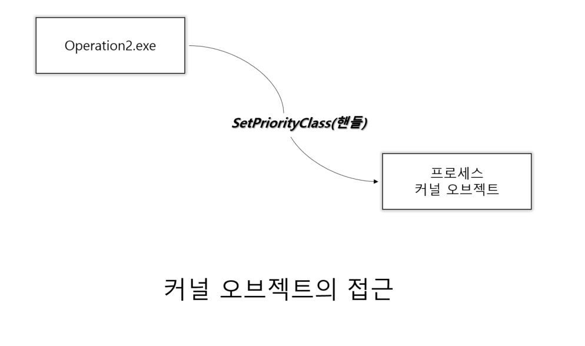
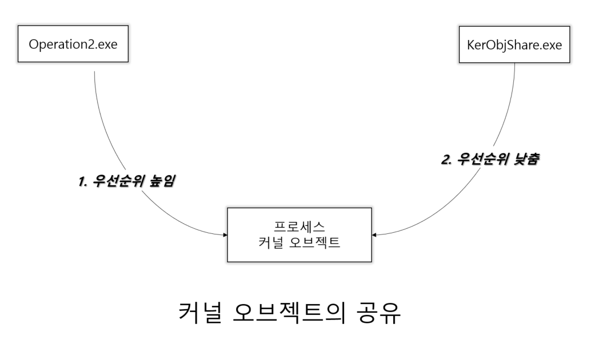

#  커널 오브젝트와 오브젝트 핸들

## 커널 오브젝트에 대한 이해

 
## 커널 오브젝트와 핸들의 종속 관계

### 커널 오브젝트의 종속 관계

커널 오브젝트는 프로세스에 종속적인 것이 아니라, 운영체제에 
종속적인 관계로 커널 오브젝트의 소멸 시점은 운영체제에 의해서 결정된다.

### 핸들의 종속 관계

커널 오브젝트는 프로세스에 종속적이지 않고 운영체제에 종속적이라고 설명하였다.
그러나 반대로 핸들은 운영체제에 종속적이지 않고 프로세스에 종속적이다.


### 예제를 통한 종속 관계의 이해




커널 오브젝트는 프로세스에 종속적인 것이 아니라 운영체제에 종속적인 관계로
여러 프로세스에 의해 접근이 가능하다.




## 커널 오브젝트와 Usage Count

### CloseHandle 함수에 대한 정확한 이해

A라는 이름의 프로세스가 생성되면, A 프로세스를 위한 커널 오브젝트가 생성된다.
이때 커널 오브젝트는 완전히 프로세스를 대표하게 된다.

그 역도 성립할까? 성립하지 않는다. 프로세스가 소멸된다고 해서 커널오브젝트가 소멸될 수도 있고
아닐 수도 있다. 운영체제가 결정할 일이다.

### CloseHandle 함수와 프로세스 소멸

```c++
#include "stdio.h"
#include "tchar.h"
#include "windows.h"

int _tmain(int argc, TCHAR *argv[]) {
    STARTUPINFO si = {0,};
    PROCESS_INFORMATION pi;
    si.cb = sizeof(si);

    TCHAR command[] = _T("KernelObjProb2.exe");
    CreateProcess(
            NULL, command, NULL, NULL, TRUE,
            0, NULL, NULL, &si, &pi
    );
    CloseHandle(pi.hProcess);
    
    return 0;
}

```

### 커널 오브젝트와 Usage Count

자식 프로세스의 종료 코드는 자식 프로세스의 커널 오브젝트에 저장된다.
자식 프로세스가 종료될 때 커널 오브젝트도 동시에 소멸된다면 부모 프로세스는
종료 코드를 얻을 수 없게 된다. 
때문에 프로세스가 종료되었다고 햇거 커널 오브젝트까지 동시에 소멸시키지는 않는다.

그렇다면 언제 커널 오브젝트를 소멸시키는 것이 좋을 까?
해당 커널 오브젝트를 참조하는 대상이 하나도 없을 때 소멸시키는 것이
가장 이상적이다. 

Windows 는 이러한 정책을 기반으로 커널 오브젝트 소멸 시기를 결정 짓기 위해
Usage Count(참조 횟수) 라는 것을 관리 한다. 이 Usage Count가 0이 되는 순간
해당 커널 오브젝트는 소멸된다.


## 명령 프롬프트 프로젝트 기능 추가

