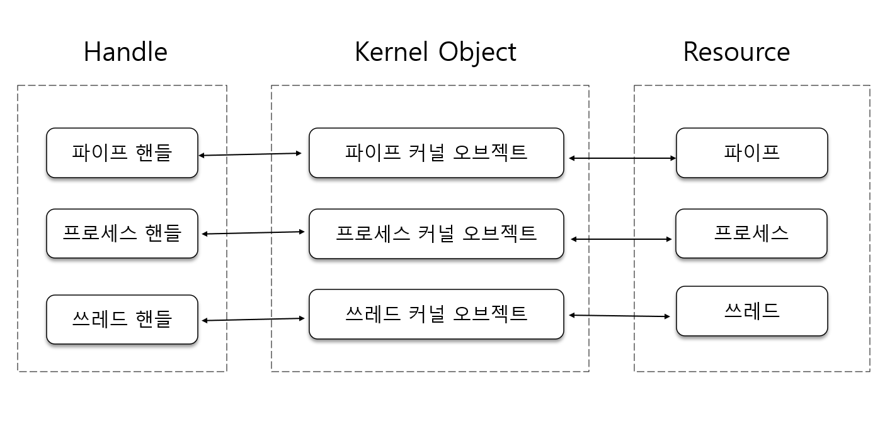
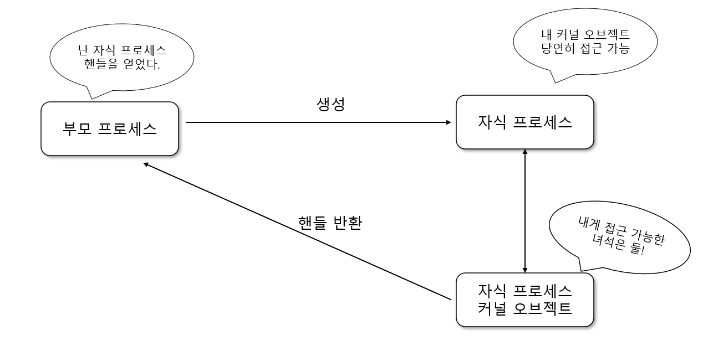
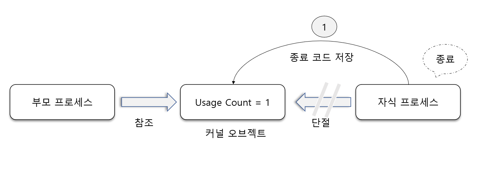
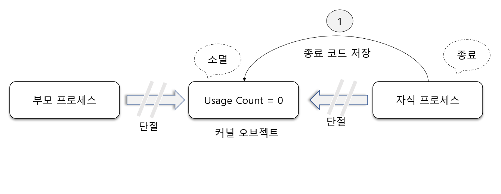

#  커널 오브젝트와 오브젝트 핸들

커널이란, 컴퓨터를 운영하는 데 있어서 중심이 되는 운영체제 핵심 부분을 뜻하는 것이다.

커널 오브젝트 : 커널에서 관리하는 중요하는 정보를 담아둔 데이터 블록을 가리킴
## 커널 오브젝트에 대한 이해

여러 개의 프로세스를 관리할 때, 운영체제 입장에서 고정적으로 저장하고 갱신해야할 정보들이
생기기 마련이다. 

예를 들어 프로세스 상태 정보와 우선순위 정보는 운영체제 내부에서 저장되어야 한다.
그리고 프로세서 상태 정보와 프로세스 우선순위 정보가 변경될 때마다 갱신되어야 한다.
그래야 프로세스 스케줄러가 이 정보를 바탕으로 프로세스를 관리할 수 있다.


정리하면

"Windows 운영체제는 프로세스, 쓰레드 혹은 파일과 같은 리소스들을 원활히 관리하기 위해
필요한 정보를 저장해야 한다. 이때 데이터를 저장하는 메모리 블록을 가리켜 커널 오브젝트라 한다."

### 오브젝트 핸들(Handle)을 이용한 커널 오브젝트의 조작
프로그래머가 직접 커널 오브젝트를 조작할 수 없지만 함수 호출에 의한 간접적인 조작은 가능하다.
Windows 에서 관리하는 리소스 특성을 변경시키기 위해서는 (프로세스 우선순위 변경과 같은)
해당 리소스의 커널 오브젝트르 조작해야만 하는데, 직접적인 조작은 불가능하지만 
마이크로소프트에서 제공해 주는 시스템 함수를 이용하면 간접적 조작은 가능하다.


`핸들 이란?` 커널 오브젝트에 할당되는 숫자에 불과하다.

### 커널 오브젝트에 할당되는 숫자! 핸들(Handle)

1. 특정 프로세스의 우선순위를 높여보자
2. 우선순위 정보를 변경해줘야 한다. 우선 순위 정보는 프로세스 커널 오브젝트에 존재한다.
3. 여기에 저장되어 있는 우선순위 정보를 변경해야만 실제 프로세스에 반영될 것이다.
4. 특정 커널 오브젝트를 어떻게 가리킬까?
5. Windows는 커널 오브젝트를 생성할 때마다 핸들이라는 정수값을 부여한다. 
6. 이 정수값으로 커널 오브젝트를 지시하면 된다.


 
## 커널 오브젝트와 핸들의 종속 관계

### 커널 오브젝트의 종속 관계

커널 오브젝트는 프로세스에 종속적인 것이 아니라, 운영체제에 
종속적인 관계로 커널 오브젝트의 소멸 시점은 운영체제에 의해서 결정된다.

### 핸들의 종속 관계

커널 오브젝트는 프로세스에 종속적이지 않고 운영체제에 종속적이라고 설명하였다.
그러나 반대로 핸들은 운영체제에 종속적이지 않고 프로세스에 종속적이다.


### 예제를 통한 종속 관계의 이해


커널 오브젝트는 프로세스에 종속적인 것이 아니라 운영체제에 종속적인 관계로
여러 프로세스에 의해 접근이 가능하다.


### PROCESS_INFORMATION 구조체 

```asm
typedef struct _PROCESS_INFORMATION
{ HANDLE			hProcess; // 프로세스의 핸들
  HANDLE			hThread;  // 쓰레드 핸들
  DWORD 			dwProcessId; // 프로세스의 ID
  DWORD 			dwThreadId; // 쓰레드 ID
} 
```

프로세스 핸들은 프로세스의 커널 오브젝트를 가리키기(구분짓기) 위한 것이고,
프로세스 ID는 커널 오브젝트가 아니라 프로세스 자체를 구분짓기 위한 것이다.


## 커널 오브젝트와 Usage Count

### CloseHandle 함수에 대한 정확한 이해

A라는 이름의 프로세스가 생성되면, A 프로세스를 위한 커널 오브젝트가 생성된다.
이때 커널 오브젝트는 완전히 프로세스를 대표하게 된다.

그 역도 성립할까? 성립하지 않는다. 프로세스가 소멸된다고 해서 커널오브젝트가 소멸될 수도 있고
아닐 수도 있다. 운영체제가 결정할 일이다.

### CloseHandle 함수와 프로세스 소멸

```c++
#include "stdio.h"
#include "tchar.h"
#include "windows.h"

int _tmain(int argc, TCHAR *argv[]) {
    STARTUPINFO si = {0,};
    PROCESS_INFORMATION pi;
    si.cb = sizeof(si);

    TCHAR command[] = _T("KernelObjProb2.exe");
    CreateProcess(
            NULL, command, NULL, NULL, TRUE,
            0, NULL, NULL, &si, &pi
    );
    CloseHandle(pi.hProcess);
    
    return 0;
}

```

### CloseHandle 함수와 프로세스 종료 코드

운영체제는 프로세스가 종료되면 커널 오브젝트를 소멸시킨다.


### 커널 오브젝트와 Usage Count

자식 프로세스의 종료 코드는 자식 프로세스의 커널 오브젝트에 저장된다.
자식 프로세스가 종료될 때 커널 오브젝트도 동시에 소멸된다면 부모 프로세스는
종료 코드를 얻을 수 없게 된다. 
때문에 프로세스가 종료되었다고 햇거 커널 오브젝트까지 동시에 소멸시키지는 않는다.

그렇다면 언제 커널 오브젝트를 소멸시키는 것이 좋을 까?
해당 커널 오브젝트를 참조하는 대상이 하나도 없을 때 소멸시키는 것이
가장 이상적이다. 

Windows 는 이러한 정책을 기반으로 커널 오브젝트 소멸 시기를 결정 짓기 위해
Usage Count(참조 횟수) 라는 것을 관리 한다. 이 Usage Count가 0이 되는 순간
해당 커널 오브젝트는 소멸된다.



프로세스는 생성과 동시에 커널 오브젝트의 Usage Count가 1이 된다.
만약 생성과 동시에 Usage Count 가 0으로 초기화 된다면,
커널 오브젝트 소멸 원칙에 의해 생성과 동시에 소멸되고 만다.
이를 막기 위해서 자식 프로세스는 생성과 동시에 Usage Count가 1이 된다.

## Usage Count 와 CloseHandle


자식 프로세스가 종료되면 커널 오브젝트에 접근하는 대상이 하나 줄어든다.



CloseHandle 함수는 핸들을 반환하면서 커널 오브젝트의 Usage Count를 하나 감소시키는 기능을 지닌다.


## 명령 프롬프트 프로젝트 기능 추가

