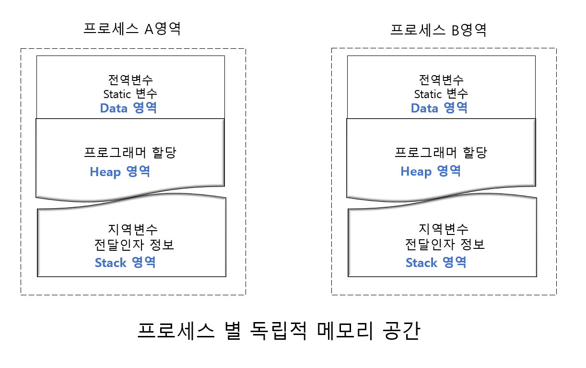
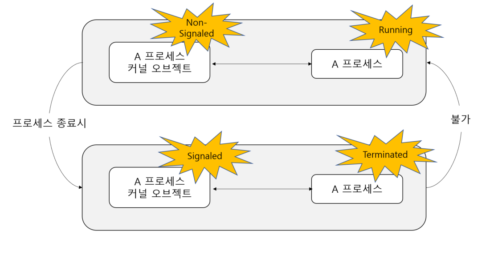
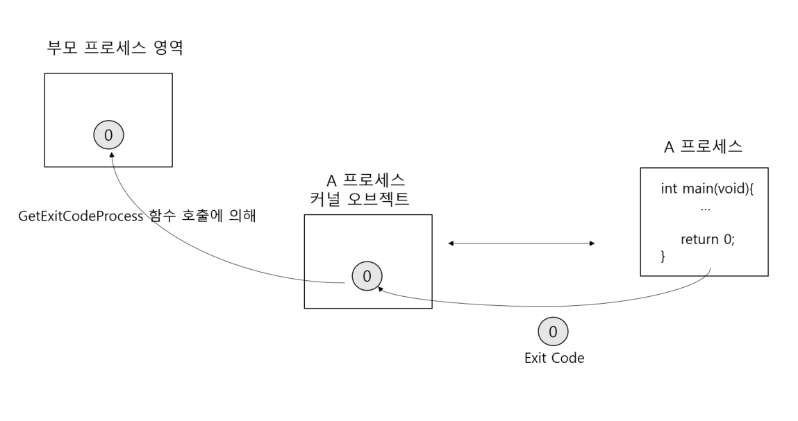

# 프로세스간 통신

## 프로세스간 통신(IPC) 의 의미

IPC 는 Inter-Process Communication 의 약자로 "프로세스 사이의 통신" 이라는
뜻을 지닌다.

### 프로세스 사이에서 통신이 이뤄지기 위한 조건
서로 통신하고자 하는 프로세스가 서로 만날 수 있는 여건(공유하는 메모리 영역이 존재하는 것을 의미)이 허락되면 프로세스간 통신은
아주 쉬워진다. 그러나 프로세스들이 서로 만날 수 있는 여건이 허락되지 않는다면,
전화나 메신저와 같은 보조 수단이 필요하다.

### 프로세스들이 서로 만날 수 없는 이유
프로세스들은 서로 만나서 데이터를 주고 받는 것이 불가능하다. 
서로 데이터를 주고 받을만한 접선 장소를 마련할 수 없기 때문이다.



프로세스 A와 프로세스 B가 현재 실행 중에 있다면 위와 같은 형태의 메모리 구조가 형성될 것이다.

프로세스들은 자신에게 할당된 메모리 공간 이외에는 접근이 불가능하다.


## 메일 슬롯 방식의 IPC


### 메일 슬롯(Mail Slot) 원리

메일슬롯은 파이프와 더불어 대표적인 IPC 기법이다.

메일슬롯의 기본 원리는 다음과 같다.

"데이터를 주고 받기 위해서 프로세스가 우체통을 마련하는 것 "

메일 슬롯 Sender

```c
#include "stdio.h"
#include "tchar.h"
#include "windows.h"

#define SLOT_NAME  _T("\\\\.\\mailslot\\mailbox")

int _tmain(int argc, TCHAR * argv[])
{
    HANDLE hMailSlot;
    TCHAR message[50];
    DWORD byteWritten;  // number of bytes write

    hMailSlot = CreateFile(
            SLOT_NAME,  // 메일 슬롯의 이름(주소)
            GENERIC_WRITE, // 사용되는 용도
            FILE_SHARE_READ,
            NULL,
            OPEN_EXISTING, // 생성 방식
            FILE_ATTRIBUTE_NORMAL,
            NULL
            );
    if (hMailSlot == INVALID_HANDLE_VALUE)
    {
        _fputts(_T("Unable to create mailslot! \n") ,stdout);
        return 1;
    }

    while (1)
    {
        _fputts(_T("MY CMD>"),stdout);
        _fgetts(message , sizeof(message) / sizeof(TCHAR) , stdin);

        if (!WriteFile(hMailSlot , message , _tcslen(message) * sizeof(TCHAR) , &byteWritten , NULL)){
            _fputts(_T("Unable to write!") , stdout);
            CloseHandle(hMailSlot);
            return 1;
        }

        if (!_tcscmp(message, _T("exit")))
        {
            _fputts(_T("Good Bye!"), stdout);
            break;
        }
    }
    CloseHandle(hMailSlot);
    return 0;
}
```


### 메일 슬롯의 고찰과 앞으로의 전개에 대해서

메일 슬롯은 단방향 통신만 가능하다.

`메일슬롯과 IPC 에 대한 고찰`

메일 슬롯은 한쪽 방향으로만 메시지를 전달할 수 있다.
따라서 두 프로세스가 서로 메시지를 주고 받을 수 있는 채팅 프로그램 구현을 위해서는
두 개의 메일슬롯을 생성해야만 한다. 

메일 슬롯은 브로드캐스팅 방식의 통신을 지원한다. 즉, 하나의 Sender는 한번의 메시지 전송으로
여러 Receiver 에게 동일한 메시지를 동시에 전송하는 것이 가능하다. 

## Signaled vs Non-Signaled

### 커널 오브젝트의 두 가지 상태(State)

- Signaled 상태(신호를 받은 상태)
- Non-Signaled 상태 (신호를 받지 않은 상태)

커널 오브젝트의 상태 정보는 커널 오브젝트를 구성하는 멤버 변수 중 하나에 저장되어 있다.


### 프로세스 커널 오브젝트의 상태(State) 에 대한 이해

커널 오브젝트의 상태는 리소스에 특정 상황이 발생하였음을 알려주기 위해서
존재하는 것이다.
그런데 특정 상황이라는 것이 리소스마다 다르다.
때문에 커널 오브젝트의 상태가 변하는 시점은 커널 오브젝트의 종류에 따라서 달라진다.

프로세스 커널 오브젝트는 프로세스가 생성될 때 만들어진다.
이렇게 처음 커널 오브젝트가 생성되면 커널 오브젝트의 상태는 Non-Signaled 상태에
놓이게 된다. 그러다가 프로세스가 종료되면 Signaled 상태로 변경된다.

정리하자면 프로세스 커널 오브젝트는 프로세스 실행 중에는 Non-Signaled 상태에 놓인다.
그러다가 프로세스가 종료되면 Windows 운영체제에 의해서 자동적으로 Signaled 상태가 된다.




Signaled 상태에서 Non-Signaled 상태로 변경되는 시점은?
아마도 종료된 프로세스가 다시 실행을 재개하면 Non-Signaled 상태가 되지 않을까?
하지만 종료된 프로세스는 다시 실행을 재개하지 못한다.

종료된 프로세스는 다시 살릴 수 없고 새로 다시 실행해야 한다.

즉 프로세스 커널 오브젝트의 상태는 일단 Signaled 가 되면 절대로 다시 Non-Signaled
상태로 변경되지 않는다.

### 커널 오브젝트의 두 가지 상태를 확인하는 용도의 함수

```asm
DWORD WaitForSingleObject(
        HANDLE hHandle,
        DWORD dwMillseconds
        );
```


### `커널 오브젝트의 상태 확인이 필요한 상황의 연출`

```c
#include "stdio.h"
#include "tchar.h"
#include "windows.h"

int _tmain(int argc , TCHAR * argv[])
{
    if (argc != 3)
        return -1;

    DWORD start = _ttoi(argv[1]);
    DWORD end = _ttoi(argv[2]);

    DWORD total = 0;
    for (DWORD i= start; i<=end; i++) {
        total += i;
    }
    return total;
}
```




### WaitForSingleObject 함수의 유용성

부모 프로세스의 입장에서 자식 프로세스가 종료될 때까지 기다리는 것은 가능한 일인가?

WaitForSingleObject 함수를 사용하면 충분히 가능하다.

부모 프로세스는 CreateProcess 함수 호출 과정에서 자식 프로세스의 핸들을 얻게 된다.
이 핸들을 인자로 전달하면서 WaitForObject 함수를 호출하면 부모 프로세스는 
자식 프로세스가 종료될 때까지 기다리는 효과를 얻게 된다.

