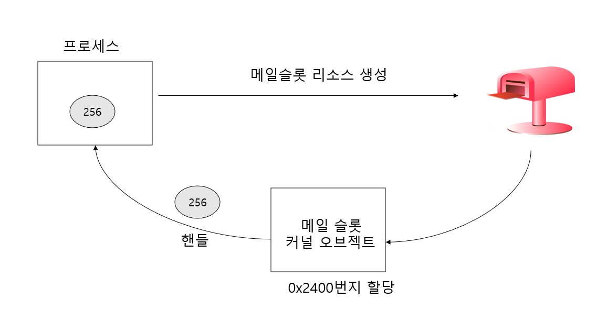
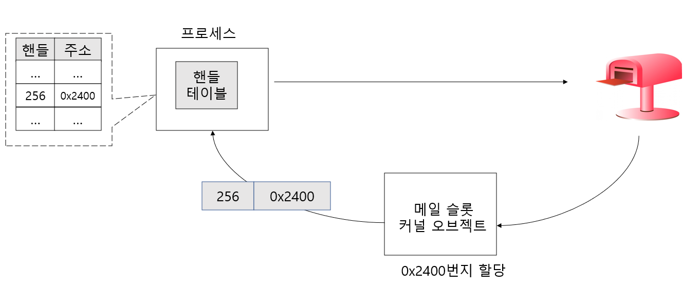
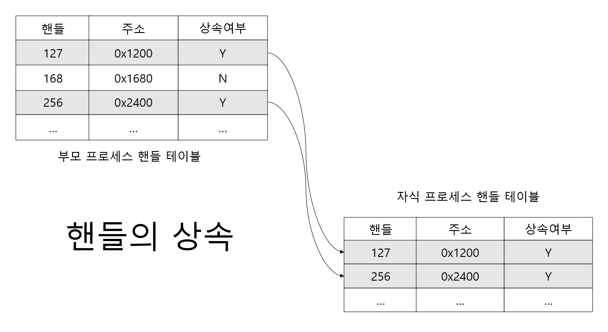
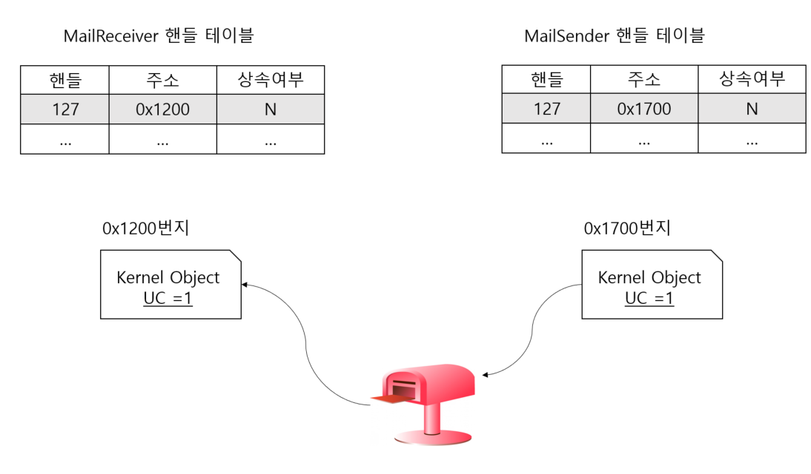
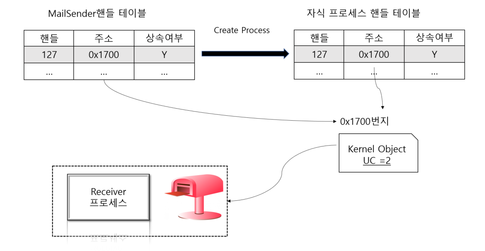

# 프로세스간 통신(IPC) 2

## 핸들 테이블과 오브젝트 핸들의 상속



0x2400 번지에 메일슬롯 정보를 저장하는 커널 오브젝트 생성 ,
256 은 커널 오브젝트를 가리키는 용도로 사용되는 핸들

핸들 256이 0x2400 번지에 존재하는 커널 오브젝트인지 알 수 있는 방법은??

### 프로세스의 핸들 테이블 도입



위 그림에서 프로세스로 전달되는 핸들 정보가 어떻게 전달 및 저장되는지 구체적으로 보여준다.

핸들 테이블은 핸들 정보를 저장하고 있는 테이블로서 프로세스별로 독립적이다.
쉽게 말해서 각각의 프로세스가 자신만의 핸들 테이블을 하나씩 구성하고 관리한다.

### 핸들의 상속

CreateProcess 함수를 호출하면 새로운 자식 프로세스가 생성된다.
물론 자식 프로세스를 위한 핸들 테이블도 더불어 생성된다.

CreateProcess 함수 호출 시 전달되는 인자(CreateProcess 의 다섯 번째 전달인자)가
무엇이냐에 따라서 부모 프로세스 핸들 테이블에 등록되어 있는 핸들 정보는 새롭게
생성된느 자식 프로세스에게 상속될 수 있다.

### 헨들의 상속에 대한 이해

자식 프로세스는 부모 프로세스의 핸들 테이블에 등록되어 있는 핸들 정보를 상속받을 수 있다.
하지만 모든 정보를 상속 받는 것은 아니다.



위 그림과 같이 실제 핸들 테이블에는 해당 핸들의 상속 여부를 결정짓기 위한 컬럼이 존재한다.

부모 프로세스로부터 핸들 127,256에 대한 정보는 자식 프로세스에게 상속된다.

그리고 상속 여부에 대한 정보도 변경 없이 그대로 상속된다.
따라서 자식 프로세스가 또 다른 자식 프로세스를 생성할 경우에도 이 핸들에 대한
정보는 계속해서 상속된다.


### 핸들의 상속과 커널 오브젝트의 Usage Count

커널 오브젝트의 Usage Count 는 참조하는 프로세스의 수만큼 증가한다.
그렇다면 커널 오브젝트를 참조하는 프로세스가 되기 위한 조건은 ??

핸들을 얻은 프로세스가 커널 오브젝트를 참조하는 프로세스가 된다.
그리고 프로세스가 핸들을 얻게 되었다는 말은 핸들 테이블에 해당 핸들에 대한 정보가 
갱신되었음을 의미한다.


예를 들어, CreateMailSlot 함수의 호출을 통해 메일 슬롯을 생성했다고 가정하자

1. 메일슬롯 리소스 생성
2. 커널 오브젝트 생성
3. 핸들 정보가 핸들 테이블에 갱신
4. CreateMailSlot 함수를 빠져 나오면서 핸들 값 반환


### 상속이 되기 위한 핸들의 조건

핸들의 상속 여부는 리소스가 생성되는 순간에 결정된다.
그것도 프로그래머에 의해서 결정이 된다. 

```asm
HANDLE CreateMailslot(
    LPCTSTR IpName,
    DWORD nMaxMessageSize,
    DWORD IReadTimeout,
    LPSECURITY_ATTRIBUTES IpSecurityAttributes
   
);
```

CreateProcess 함수 호출 시 핸들 상속과 관련해서 두 가지 사항을 결정해야 한다.
하나는 자식 프로세스에게 핸들 테이블을 상속할 것인가 하는 것이다. 또 하나는
자식 프로세스 생성 시 얻게 되는 핸들(자식 프로세스를 가리키는 핸들이다!)의 상속 여부를 결정하는 것이다.



Receiver 핸들 테이블의 핸들 127 으
0X1200 번지에 있는 커널 오브젝트를 가리기고 있다.  이 커널 오브젝트는 CreateMailslot 함수
호출에 의해서 생성된 것이다. 

오른쪽에 있는 Sender 의 핸들테이블의 핸들 127은 0x1700 번지에 있는 커널 오브젝트를 
가리키고 있는데 , 이 커널 오브젝트는 CreateFile 함수 호출에 의해 생성된 것이다.




MailSender 가 CreateProcess 함수 호출을 통해 자식 프로세스를 생성하였다.

이때 핸들 정보가 상속되었기 때문에 자식 프로세스는 상속된 핸들 정보를 참조해서
메일슬롯으로 데이털르 전송할 수 있게 되었다.

### Pseudo 핸들과 핸들의 중복(Duplicate)

현재 실행 중에 있는 프로세스 자신의 핸들을 얻는 방법으로 GetCurrentProcess 함수가 있다.
실제로 이 함수 호출을 통해 얻은 핸들을 이용해서 프로세스 자신의 커널 오브젝트에 접근이 가능하다.

그런데 이 함수 호출을 통핼 얻은 핸들을 가리켜  가짜 핸들 이라고 한다.
왜냐하면 이렇게 얻어진 핸들은 핸들 테이블에 등록되어 있지 않은 핸들이고, 
다만 현재 실행 중인 프로세스를 참조하기 위한 용도로 정의 해 놓은 , 약속된 상수가
반환되는 것이기 때문이다.

## 파이프 방식의 IPC

### 메일 슬롯에 대한 회고와 파이프의 이해

Windows 의 파이프 매커니즘에는 두 가지 종류가 있는데,
하나는 "이름 없는 파이프" 이고 하나는 "이름있는 파이프"이다.

메일 슬롯은 서로 관련이 없는 프로세스들 사이에서 통신할 때 유용한 IPC 기법이다.

반면 이름없는 파이프는 지극히 관계까 있는  프로세스들 사이에서 통신하는 경우에 유용하다.


이름있는 파이프의 경우 이름이 있기 때문에 주소 정보가 있다는 것으로, 메일 슬롯과 
비슷한 특징을 보인다. 주소가 있다는 뜻은 메일슬롯 처럼 서로 관계가 없는 프로세스들 사이에서도
주소 정보를 공유함으로써 데이터를 주고 받을 수 있다는 뜻이다.

메일슬롯과 다른점은 이름있는 파이프는 양방향 통신이 가능하다는 것이다.

반면 메일슬롯은 브로드캐스트 방식의 데이터 전송이 가능하다.


정리하면 다음과 같다.
- 메일 슬롯 : 브로드캐스트 방 식의 단방향 통신방식을 취하며, 메일 슬롯에 할당된 주소를 
기반으로 통신하기 때문에 관계없는 프로세스들 사이에서도 통신이 가능하다.
- 이름없는 파이프 : 단방향 통신 방식을 취하며, 파이프를 통해서 생성된 핸들을 기반으로 통신하기 때문에
프로세스들 사이에서 관계가 있어야만 한다.
- 이름있는 파이프 : 메일슬롯과 유사하다. 차이가 있다면, 브로드캐스트 방식을 지원하지 않는 대신에
양방향 통신을 지원한다는 점이다.


### 이름없는 파이프 (Anonymous Pipe)

이름없는 파이프를 생성하는 함수

```asm
BOOL CreatePipe(
      PHANDLE hReadPipe,
      PHANDLE hWriterPipe,
      LPSECURITY_ATTRIBUTES lpsecurityAttributes
      DWORD  nSize
);
```

  

## 프로세스 환경변수

## 명령 프롬프트 프로젝트 기능 추가

