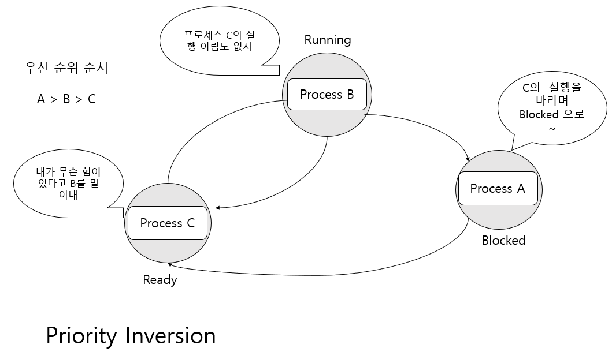

# 스케줄링 알고리즘과 우선순위

## 프로세스의 스케줄링

### 일반 OS 와 리얼타임 (Real Time) OS 의 차이점

RTOS 와 일반 OS 의 차이는 응답성(응답속도)에 있다.

RTOS는 사용하는 영역이 제한적이다. 범용적인 OS 보다 하는 일이 적다.
프로그래머가 시키지 않은 일은 아예 할 생각도 안 한다.

정리하면 RTOS는 일반 OS에 비해서 속도가 빠른 것이 아니다.
사용되는 목적이 구체적이고 제한적이다 보니, 보다 단순하게 
디자인되어 있고 일반 OS에 비해서 훨씬 가볍다.
따라서 응답성이 좋을 뿐이다.

### Soft RTOS vs Hard RTOS

전통적으로 말하는 RTOS 는 Hard RTOS를 의미한다. 
Hard RTOS 는 일반 OS에 비해서 단순히 응답성이 좋은 정도로 설명되지 않는다.

HardRTOS에서 중요시 하는 것은 단순히 개선된 응답성이 아니라, 데드라인이다.

데드라인이 중요한 시스템에서 이를 충족시킬 수 있는 능력을 지니는 RTOS르 가리켜
Hard RTOS 라 한다.

데드라인 충족은 단순히 CPU 의 속도가 빠르다고 해서 만족되는 것이 아니기 때문에
Hard RTOS 를 디자인 하는 것은 결코 쉬운 일이 아니며, 이를 위해서는 일반 OS 와 전혀 다른
알고리즘으로 스케줄러가 디자인된다.

### 선점형(Preemptive) OS 와 비선점형(Non-Preemptive ) OS

OS 를 구분할 때 응답성을 기준으로 범용 OS와 RTOS 를 구분하듯이,
프로세스의 실행을 다른 프로세스로 넘기는 방식에 따라서 선점형 OS와 비선점형 OS를 구분한다.

`비선점형 OS` 

비선점형 OS는 현재 실행 중인 프로세스보다 높은 우선순위의 프로세스가 등장한다고 해서
실행의 대상을 바로 변경하지 않는다. 새로 등장한, 보다 높은 우선순위의 프로세스가
실행되기 위해서는 현재 실행 중인 프로세스가 명시적으로 CPU를 양보할 때까지,
혹은 I/O 작업 등으로 블로킹 상태에 놓일 때 까지 기다려야만 한다.
따라서 이러한 비선점형 OS의 경우에는 인터렉티브 한 프로그램 구현 시 프로그래머 의존도가 
높아지는 문제점을 지닌다. 프로그래먼느 자신이 개발한 프로그램이 주구장창 CPU를 독차지하지 않도록
신경을 써서 프로그래밍해야 한다. 

`선점형 OS`

선점형 OS 는 현재 실행 중인 프로세스보다 높은 우선선위의 프로세스가 등장하면 
스케줄러에 의한 실행순서 조정이 적극 가해진다.

### 우선순위(Priority) 스케줄링 알고리즘

우선순위 스케줄링 알고리즘이란 각각의 프로세스마다 우선순위를 부여해서 우선순위가 높은 프로세스를
먼저 실행시키는 방식이다.

### 라운드 로빈(Round-Robin) 스케줄링 알고리즘

우선순위가 높은 프로세스가 먼저 실행된다고 하였는데, 
그렇다면 우선순위가 동일한 프로세스의 경우에는 누가 먼저 실행될까?

여기서 형평성 문제가 발생하게 되는데,

그래서 Windows는 라운드 로빈 스케줄링 알고리즘을 적용하고 있다.
이 알고리즘은 같은 우선순위의 프로세스들간 형평성 유지를 위해, 정해진 
시간 간격만큼만 실행을 하고 우선순위가 동일한 다른 프로세스에게 CPU의 할당을
넘기는 방식을 제공한다. 오로지 형평성 유지를 위해서다.

실행의 최소 단위 시간 간격을 가리켜 퀀텀 혹은 타임 슬라이스라 하는데,
동일한 우선순위의 모든 프로세스들은 이 타임 슬라이스를 기준으로 CPU의 할당을 넘기게 된다.

타임 슬라이스르 어느 정도로 두느냐에 따라서 운영체제의 성격이 달라지기도 하는데,
타임 슬라이스를 길게하면 인터렉티브한  시스템에서 문제가 될 수 있다.
즉 여러분이 마우스로 드래그앤드롭을 하는데 반응이 늦게 나타나는 것이다.
그렇다고 해서 타임 슬라이스를 너무 짧게 잡으면 컨텍스트 스위칭이 자주 발생해서 ㅅ
성능에 저하를 가져다 준다. 

Windows 운영체제는 프로세스를 스케줄링 하는데 있어서 우선순위, 그리고 라운드 로빈 기반의
알고리즘을 적용하고 있다.

### 스케줄링 알고리즘에 의해서 스케줄링이 진행되는 시점

1. 라운드 로빈 방식
    - 정해진 시간이 지나면 다음 프로세스에게 실행순서를 넘겨야 한다. 그런데 실행순서를 넘기기 위해서는
   스케줄러가 동작해야 한다. 즉, 프로세스의 실행 시간 간격에 해당하는 매 타임 슬라이스마다 동작해야 한다.
2. 우선순위 방식의 스케줄링 알고리즘
   - 우선순위가 높은 프로세스는 무조건 먼저 실행되야 한다. 따라서 새로운 프로세스가 등장할 때마다 스케줄러는 
   현재 실행중인 프로세스와 새로운 프로세스를 비교해야 한다. 즉 새로운 프로세스가 생성될 때마다 
   스케줄러는 동작해야 한다. 조금 더 나아가서 반대로 현재 실행 중인 프로세스가 종료된다면 다른 프로세스를 실행 시켜야 하므로 이 경우데도 스케줄러가 동작해야 한다.
3. 블로킹 상황
    - 현재 실행 중인 프로세스가 블로킹 상황이 되면 다른 프로세스가 대신 실행된다.
    따라서 현재 실행  중인 프로세스가 블로킹 상태에 놓이면 다음 실행될 프로세스 선정을 위해서도 
   스케줄러가 동작하게 된다. 

### Priority Inversion

말 그대로 프로세스의 우선순위가 뒤 바뀌는 현상을 말한다.

## Windows 프로세스 우선순위

