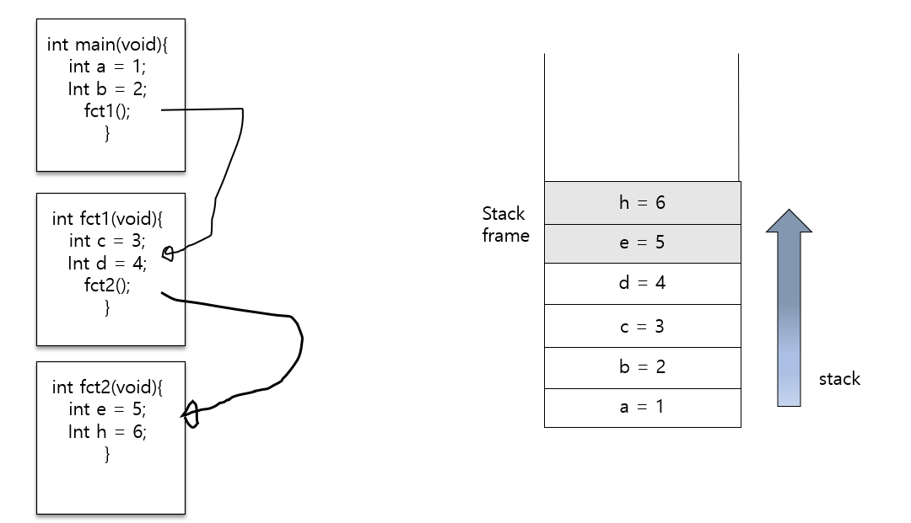
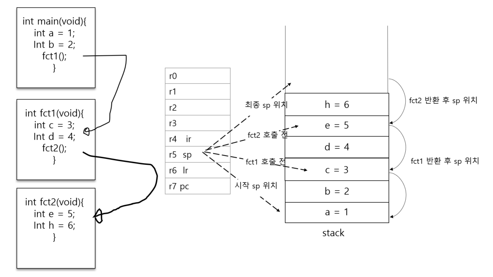
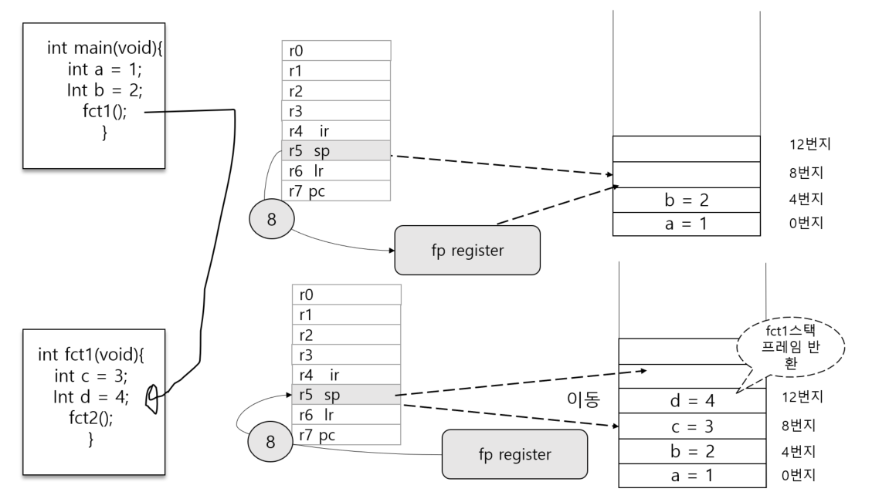
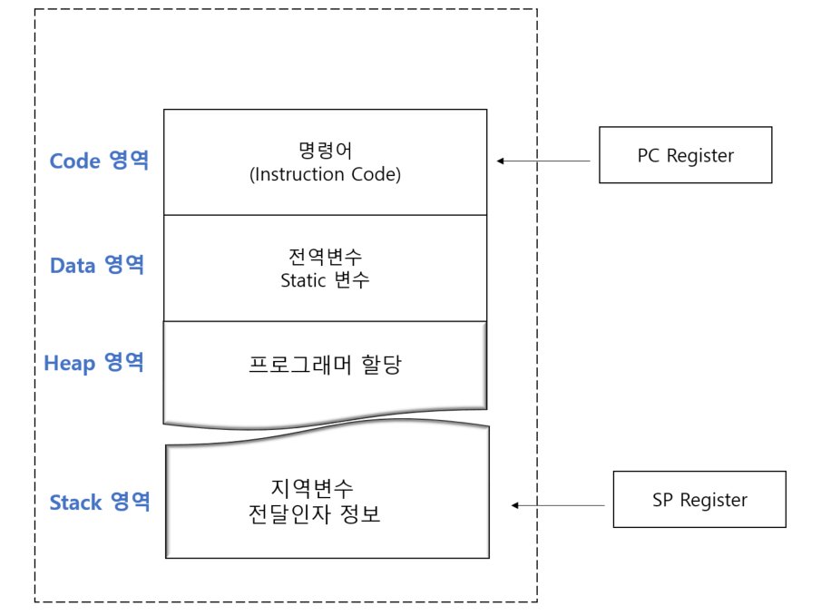

# 컴퓨터 구조에 대한 세 번째 이야기

## 절차적 함수 호출(Procedure Call) 지원 CPU 모델

### 스택 프레임(Stack Frame) 구조

함수 호출 과정에서 할당되는 메모리 블록(지역 변수의 선언으로 인해 할당되는 메모리 블록)을
가리켜 스택 프레임이라 한다.

함수 호출이 완료되면 기존에 선언된 지역변수에 접근이 불가능하다.
주소를 알고 있다 하더라도 말이다. 이는 할당되었던 메모리가 반환되었음을 의미하는 것이다.

따라서 다음과 같이 말할 수 있다.

"fct2 함수가 호출되면서 이 함수 내에 선언된 변수 e와 h가 스택에 할당되는데, 이 메모리 블록을 가리켜
스택 프레임이라 한다. fct2 함수가 반환됨녀 이 스택 프레임은 모두 반환된다."

### sp 레지스터

지역 변수를 위한 메모리 공간을 스택이라 이름 붙인 이유는 메모리의 구조적 특성 때문이다.
스택 프레임은 가장 먼저 할당되면, 가장 나중에 반환된다. 
그리고 가장 나중에 할당되면, 가장 먼저 반환된다. 
이것이 스택이라 불리는 이유이다.

스택에 데이터를 쌓거나 반환하기 위해서 현재 어느 위치까지 데이터를 저장했는지 기억해야 한다.
스택 위치를 기억해야만 한다는 뜻이다.

이를 위해 CPU 내에 sp(Stack Pointer)라는 이름의 레지스터가 존재한다.

sp 레지스터 값은 변수가 하나 하나씩 할당될 때마다 증가한다.
증가하면서 다음 변수가 할당될 메모리 위치를 가리키게 된다.

변수가 선언되면 현재 sp 가 가리키는 위치에 할당되기 때문에, sp 위치를 아래ㅐ로 이동시키는 것
만으로 이전에 선언된 변수를 반환할 수  있다.

### 프레임 포인터(Frame Pointer) 레지스터

되돌아 갈 (함수 호출 이전의) sp 위치를 저장해 놓는 레지스터를 가리켜 
fp(Frame Pointer) 라고 한다.

이 구조는 여러 함수가 호출 될 때
fp 레지스터에 저장되어 있는 값이
덮어 써지게 되고 초기에 sp 레지스터가 가리켜야 할 위치를 찾지 못한다.

이를 해결하기 위해서??

### 스택에 저장하자, 프레임 포인터(Frame Pointer)

## 함수 호출 인자의 전달과 PUSH & POP 명령어 디자인

### 함수 호출 인자의 전달방식

함수 호출 시 전달되는 인자를 어디에다 둘 것이냐에 대한 해답도 CPU 마다,
혹은 CPU 를 제조한 제조사의 표준에 따라 달라진다.

### PUSH & POP  명령어 디자인

다음 문장이 말하는 바가 인자 전달의 핵심 연산이다.
지역 변수 할당과 차이가 없다. 

"sp가 가리키는 현재 위치에 전달되는 인자값을 저장하고 나서, sp를 증가시켜 다음 메모리 주소르
가리키게 한다."

## 함수 호출에 의한 실행의 이동

프로그램이 실행되는 원리에 대해서 살펴보고

프로그램 작성 시 정의하고 호출되는 함수의 원리도 고민해 보자

### 다시 살펴보는 메모리 구조와 프로그램 카운터(Program Counter)

코드 영역은 프로그램이 동작하기 위한 프로그램 코드(컴파일 된 명령어들의 집합) 가 
올라가는 위치이다. 
프로그램을 실행시키면 위와 같은 메모리 구조가 형성되고 코드 영역에, 실행되어야 할 명령어들이
올라가서 순차적인 실행이 이뤄지게 된다. 

명령어의 실행은 Fetch , Decode , Execution 세 단계로 구분되어 있다.

첫 번째 단계가 명령어를 CPU 내부로 가져오는 Fetch 단계인데,
이때 명령어를 가져오게 되는 위치는 프로그램 코드가 존재하는 코드 영역이다. 

명령어의 길이가 4바이트라고 한다면 , 그리고 실행 중인 프로그램이 현재 1036번지에 있는
명령어라면, 다음 번에는 1040 번지에 있는 명령어가 Fetch 되어야 한다. 
어느 위치에 있는 명령어까지 가져와 실행했는지 기억하고 있어야만 다음 번에 실행할 명령어를
가져올 수 있다. 이 정보를 어디에 두는 것이 좋겠는가?

CPU가 메모리 영역 중 스택을 컨트롤하기 위해 sp 레지스터를 두었던 것처럼, 명령어를
순차적으로 fetch 하기 위해서 프로그램 카운터라 불리는 "pc 레지스터"를 둔다.                                               

## 함수 호출 규약

함수 호출 시 인자를 전달하는 방식과 스택 프레임을 반환하는 방식을 약속해 놓은 것을
함수 호출 규악이라 부른다.

