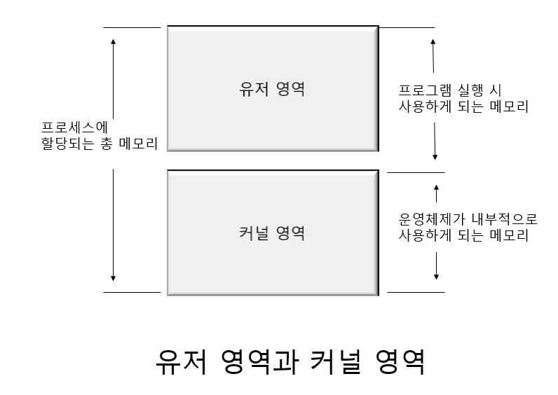

# 쓰레드의 이해

## 쓰레드란 무엇인가?

### 멀티 프로세스 기반 프로그램

둘 이상의  서로 다른 프로그램 실행을 위해서 둘 이상의 프로세스를 생성하는 것은
지극히 당연한 일이다. 음악을 듣기 위해 MP3 플레이어를 실행시키고,
문서 작업을 위해 WORD 프로그램을 실행시키면 기본적을 두 개의 프로세스는 생성된다. 

그러나 하나의 프로그램이 두 가지 이상의 일을 동시에 처리하기 위해서도 둘 이상의 프로세스가 필요하다.

### 멀티 프로세스 운영체제 기반 프로그램의 문제점과 새로운 제안

두 가지 이상의 일을 동시에 처리하기 위해서, 혹은 둘 이상의 실행 흐름이 필요해서
추가적으로 프로세스를 생성하는 작업은 상당히 부담스럽다.

서로 별개인 두 개의 프로그램 실행을 위해서는 어쩔 수 없는 일이지만,
하나의 프로그램이 둘 이상의 프로세스 생성을 요구한다면 이는 정말로 부담스러운 일이다.
많은 수의 프로세스 생성은 빈번한 컨텍스트 스위칭으로 이어져 성능에 영향을 미치기 때문이다.

컨텍스트 스위칭은 한 마디로 정의하면 상태 정보를 저장하고 복원하는 일련의 과정이다. 

이러한 컨텍스트 스위칭이 발생하는 빈도수는 상황과 시스템에 따라서 차이는 있지만,
아무리 못해도 초당 수십 회 이상 발생하므로 상당히 빈번하게 발생하는 편이다. 

따라서 컨텍스트 스위칭은 성능 저하의 원인이 된다.
이렇게 빈번하게 발생하는 컨텍스트 스위칭에 소요된느 시간을 조금이라도 줄일 수 있다면 
성능에 큰 향상을 기대할 수 있다. 어떻게 컨텍스트 스위칭에 소요되는 시간을 줄일 수 있게는가?

방법은 ! 저장하고 복원하는 컨텍스트 정보의 개수를 줄여주면 된다.  컨텍스트 정보란
프로세스의 상태 정보와 관련이 있으므로 결국은 프로세스 상태 정보를 줄여야 한다는 결론이 나온다.

컨텍스트 스위칭이 필요한 이유는 프로세스들이 완전히 독립되기 때문이다.
A프로세스와 B프로세스는 완전히 별개의 프로세스이다. 부모 자식 관계에 있더라도 일단
생성되고 나면 완전히 별개의 프로세스이다. 

따라서 A 프로세스가 실행을 멈추고 B프로세스에게 실행 기회를 주기 위해서는
완전히 자리를 내줘야 한다. CPU 뿐만 아니라 메모리 까지 B 프로세스가 100% 사용할 수 있도록
완전히 자리를 내줘야만 한다. 때문에 시간이 오래 걸리는 컨텍스트 스위칭이 필요하다.

### 해결책, 쓰레드

프로세스는 완전히 독립된 두 개의 프로그램 실행을 위해서 사용된다.
그러나 쓰레드는 하나의 프로그램 내에서 둘 이상의 프로그램 흐름을 만들어 내기 위해서 디자인 된 것이다.
그리고 프로세스와 달리 쓰레드간에는 공유하는 상태 정보들이 있다. 
이것이 쓰레드의 컨텍스트 스위칭을 빠르게 하는 요인이 된다.

- 쓰레드는 하나의 프로그램 내엣거 여러 개싀 실행 흐름을 두기 위한 모델이다.
- 쓰레드는 프로세스처럼 완벽히 독립적인 구조가 아니다. 쓰레드들 사이에는 공유하는 요소들이 있다.
- 쓰레드는 공유하는 요소가 있는 관계로 컨텍스트 스위칭에 걸리는 시간이 프로세스보다 짧다.

### 메모리 구조 관점에서 본 프로세스와 쓰레드

자식 프로세스가 생성되고 난 다음에는 모든 것이 부모 프로세스와 독립적이다.
물론 부모 프로세스는 자신이 가지고 있는 핸들 테이블을 상속하는 등 부모로서의 역할에
충실하지만, 이는 어디까지나 생성 과정에서 발생하는 일이다. 메모리 구조상에서 보면 
생성 이후에는 아무런 관계가 없다. 이러한 메모리 구조를 지녔기 때문에 프로세스간에
데이터를 주고 받기 위해서 IPC 라는 매커니즘이 필요한 것이다.

쓰레드를 생성할 때마다 해당 쓰레드만을 위한 스택을 생성할 뿐 
그 외의 영역은 부모 프로세스 영역을 공유하고 있다.
(사실 쓰레드는 자식 프로세스가 아니므로 부모 프로세스라는 표현은 맞지 않다. )

### `쓰레드의  특성 1 : 쓰레드마다 스택을 독립적으로 할당해 준다.` 

프로세스와 마찬가지로 쓰레드도 독립적으로 스택을 할당한다. 
스택은 함수 호출 시 전달되는 인자, 되돌아갈 주소값 및 함수 내에서 선언하는 변수 등을 
저장하기 위한 메모리 공간이다. 간단히 말해서 함수 호출 시 필요한 메모리 영역이다.
따라서 이 메모리 공간이 독립적이라는 뜻은 추가적인 실행 흐름을 만들 수 있다는 의미가 된다.
다시 말하면 실행 흐름의 추가를 위한 최소 조건아 독립된 스택의 제공이다.

### `쓰레드의 특성 2 : 코드 영역을 공유 한다. `

프로세스의 경우 100% 독립된 구조이기 때문에 다음과 같은 형태의 실행이 불가능하다.

그러나 쓰레드는 자신을 생성한 프로세스가 가지고 있는 함수를 호출할 수 있다.
왜냐하면 코드 영역을 공유하기 때문이다.

### `쓰레드의 특성 3 : 데이터 영역과 힙을 공유한다.`

IPC가 필요 없어졌다. 쓰레드간에 힙과 데이터 영역을 공유하기 때문에 쓰레드 A가 접근할 수 있는
힙과 데이터 영역은 쓰레드 B도 접근할 수있다. 따라서 힙이나 데이터 영역에 메모리
공간을 할당해서 서로 통신하는 것이 가능하다. IPC 와 같은 복잡한 통신기법은 필요가 없다.
좀 더 직관적으로 설명하면, 전역변수와 malloc 함수를 통해서 동적 할당된 메모리 공간은 
공유가 가능하다. 

### Windows에서의 프로세스와 쓰레드 

Windows 입장에서 프로세스는 단순히 쓰레드를 담는 상자에 지나지 않는다. 

사실 Windows 운영체제에 있어서 프로세스는 상태(Running , Ready , Blocked) 를 지니지
않는다. 
상태를 지니는 것은 프로세스가 아니라 쓰레드이다. 뿐만 아니라, 스케줄러가 실행의 단위로
선택하는 것도 프로세스가 아닌 쓰레드이다. 즉 Windows에 있어서 실행의 중심에 있는 것은
프로세스가 아닌 쓰레드이다. 

## 쓰레드 구현 모델에 따른 구분

### 커널 레벨 쓰레드와 유저 레벨 쓰레드

**첫 번째 경우로, 쓰레드를 생성해 주는 대상은 커널일 수 있다.** 이러한 경우 
운영체제가 제공하는 시스템 함수 호출을 통해서 쓰레드 생성을 요구해야 한다.
그러면 운영체제는 해당 쓰레드를 생성 및 관리하면서 새로운 흐름을 형성하도록 도와준다.

프로그래머 요청에 따라 쓰레드를 생성 및 스케줄링하는 주체가 커널인 경우, 이를 가리켜
커널 레벨 쓰레드라 한다. 커널 레벨에서 쓰레드가 지원된다는 뜻이다.

유저 영역은 사용자에 의해서 할당되는 메모리 공간을 의미한다. 

즉 프로그램이 동작하기 위해 사용되는 메모리 공간을 가리켜 유저 영역이라 한다.

코드영역, 데이터 영역, 스택 및 힙 영역을 가리켜 유저 영역이라 한다.

커널 영역은 하나의 프로세스에게 할당된 총 메모리 공간 중에 유저 영역을 제외한 나머지 영역을
커널 영역이라 한다.
윤영체제가 실행되기 위해서는 운영체제 역시도 메모리에 올라가야 하고, 또 일반
프로그램처럼 실행되는 과정에서 변수 선언도 하고 메모리를 동적할당하기도 한다.
이렇게 운영체제라는 하나의 소프트웨어를 실행시키기 위헤서 필요한 메모리 공간을 커널 공간이라 한다.

일판 프로그램을 실행시키기 위해서 필요한 공간과 운영체제의 실행을 위한 메모리 공간을
분리시켜 놓지 않으면 관리하는 측면에서 엄청난 곤란을 겪을 수 있다. 따라서 유저 영역과
커널 영역을 분리하는 것이다. 

**두 번째 경우로, 유저 레벨 쓰레드 모델이다.**  
멀티 프로세스 운영체제라고 해서 커널이 기본적으로 쓰레드를 지원하는 것은 아니다.

쓰레드를 지원하지 않는 운영체제에서 유저 레벨 쓰레드 모델을 적용한 상황
쓰레드를 지원하지 않기 때문에 스케줄러가 스케줄링하는 대상은 프로세스이다.
그리고 쓰레드를 스케줄링하는 스케줄러는 유저 영역에서 실행된다. 
아래 커널 영역을 보면 커널에는 쓰레드에 대한 아무런 정보도 존재하지 않음을 알 수 있다.
유저 레벨 쓰레드 모델을 적용할 경우, 운영체제는 쓰레드의 존재를 알지도 확인하지도 못한다.

### 커널 모드와 유저 모드

Windows는 동작할 때 커널 모드와 유저 모드 중 한가지 모드로 동작한다.

"메모리는 활용 대상에 따라서 유저 영역과 커널 영역으로 나뉜다. 유저 영역은 사용자가
구현한 프로그램 동작 시 사용하게 되는 메모리 영역이고, 커널 영역은 운영체제 동작 시 사용하게 되는
메모리 영역이다. 그리고 커널이 쓰레드를 지원할 경우 쓰레드 관리가 커널 영역에서 이뤄지기 때문에
커널 레벨 쓰레드 모델이라 하고, 커널이 지원하지 않을 경우에 라이브러리를 통해서 제공받아야 하는데
이러한 경우에는 유저 영역에서 쓰레드의 관리가 이뤄지기 때문에 유저 레벨 쓰레드 모델이라 한다."

커널 영역은 유저 영역에 비해서 상대적으로 중요하다. 유저 영역에서 메모리 참조 오류가 발생한다면
기껏해야 실행 중인 프로그램에만 영향을 미치게 되지만, 커널 영역은 커널의 코드가 실행되는
영역이므로 시스템 전체에 문제를 일으킬 수도 있는 일이다. 

그런데 우리가 구현하거나 사용하는 프로그램은 유저 영역에서 실행되므로 실제로 커널 영역에서
문제를 일으킬 일은 없어 보인다. 물론 그렇다. 그러나 C 언어의 특성상 메모리 참조가
용이하기 때문에 C언어로 프로그램을 구현할 경우 이에 대한 보장을 할 수 없게 된다. 

이에 등장한 것이 커널 모드와 유저 모드이다. 일반적인 프로그램은 기본적으로 유저 모드에서
동작한다. 그러다가 Windows 커널이 실행되어야 하는 경우에는 커널 모드로의 전환이 일어난다.
다시 말하면, 커널 영역에서 실행이 이뤄져야 할 경우에는 커널 모드로의 전환이 일어나는 것이다.

### 커널 레벨 쓰레드와 유저 레벨 쓰레드의 장점 및 단점

- 커널 레벨 쓰레드의 장점 및 단점
  - 장점 :커널에서 직접 제공해 주기 때문에 안전성과 다양한 기능성이 제공된다.
  - 단점 : 커널에서 제공해주는 기능이기 때문에 유저 모드에서 커널 모드로의 전환이 빈번하게 일어난다. 따라서 이는
    성능의 저하로 이어지게 된다. 

- 유저 레벨 쓰레드의 장점 및 단점
  - 장점 : 커널은 쓰레드의 존재조차 모른다. 오로지 유저 모드로 동작하기 때문에 유저 모드에서 커널 모
  드로의 전환이 필요 없다. 때문에 성능이 좋다.
  - 단점 : 하나의 프로세스 내에 총 3개의 쓰레드 A,B,C가 있다고 가정해보자 이 중에서 A 쓰레드가
  시스템 함수를 호출했는데, 커널에 의해서 블로킹 되었다. 이럴 경우 B,C도 실행되지 않는다.
   운영체제는 프로세스의 존재만 알지 쓰레드의 존재를 모른다. 때문에 A 쓰레드가 속해 있는 프로세스
   전부가 블로킹 되는 문제를 안고 있다. 이 문제를 해결하기 위한 방법들이 있지만, 결국은 프로그래밍이
  어려워지고 커널 레벨 쓰레드에 비해서 결과 예측이 어렵게 된다.

