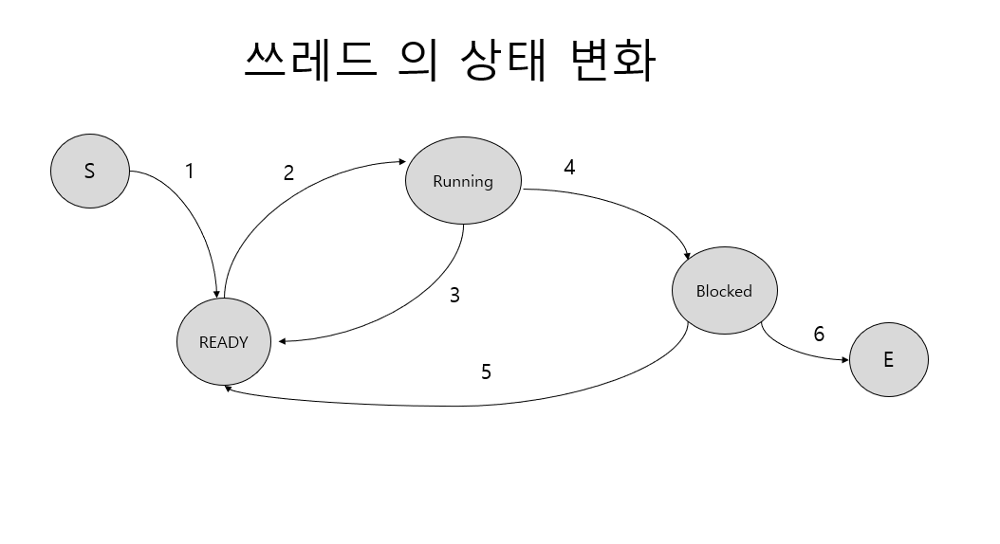

# 쓰레드의 생성과 소멸

## Windows 에서의 쓰레드 생성과 소멸

```c
#include "stdio.h"
#include "tchar.h"
#include "windows.h"

#define MAX_THREADS (1024*10)

DWORD WINAPI ThreadProc(LPVOID lpParam) {
    DWORD threadNum = (DWORD) lpParam;

    while (1) {
        _tprintf(_T("thread num : %d \n"), threadNum);
        Sleep(5000);
    }
    return 0;
}

DWORD cntOfThread = 0;

int _tmain(int argc, TCHAR *argv[]) {
    DWORD dwThreadID[MAX_THREADS];
    HANDLE hThread[MAX_THREADS];

    while (1) {
        hThread[cntOfThread] =
                CreateThread(
                        NULL,                      // 디폴트 보안 속성 지정
                        10,                         // 디폴트 스택사이즈
                        ThreadProc,                // 쓰레드 함수
                        (LPVOID) cntOfThread,       // 쓰레드 함수의 전달인자
                        0,                        // 디폴트 생성 flag 지정
                        &dwThreadID[cntOfThread] // 쓰레드 ID 반환
                );

        if (hThread[cntOfThread] == NULL) {
            _tprintf(
                    _T("MAXIMUM THREAD NUMBER : %d \n "),
                    cntOfThread
            );
            break;
        }
        cntOfThread++;
    }
    for (DWORD i = 0; i < cntOfThread; i++) {
        CloseHandle(hThread[i]);
    }
    return 0;
}
```

## 쓰레드의 성격과 특성 


```c
#include "stdio.h"
#include "tchar.h"
#include "windows.h"

static int total = 0;

DWORD WINAPI ThreadProc(LPVOID lpParam)
{
    DWORD * nPtr = (DWORD *) lpParam;

    DWORD numOne = *nPtr;
    DWORD numTwo = *(nPtr+1);

    for (DWORD i= numOne; i<=numTwo; i++)
    {
        total += i;
    }
    return 0; // 정상적 종료
}

int _tmain(int argc, TCHAR * argv[])
{
    DWORD dwThreadID[3];
    HANDLE hThread[3];

    DWORD paramThread[] = {1,3,4,7,8,10};

    hThread[0] =
            CreateThread(
                    NULL , 0 ,
                    ThreadProc ,
                    (LPVOID) (&paramThread[0]),
                    0 , &dwThreadID[0]
                    );
    hThread[1] =
            CreateThread(
                    NULL , 0 ,
                    ThreadProc ,
                    (LPVOID) (&paramThread[2]),
                    0 , &dwThreadID[1]
            );
    hThread[2] =
            CreateThread(
                    NULL , 0 ,
                    ThreadProc ,
                    (LPVOID) (&paramThread[4]),
                    0 , &dwThreadID[2]
            );

    if (hThread[0] == NULL || hThread[1] == NULL || hThread[2] == NULL)
    {
        _tprintf(_T("thread creation fault! \n"));
        return -1;
    }

    WaitForMultipleObjects(3,hThread,TRUE,INFINITE);

    _tprintf(_T("total (1~10) : %d \n"), total);

    CloseHandle(hThread[0]);
    CloseHandle(hThread[1]);
    CloseHandle(hThread[2]);
    return 0;
}
```

### ANSI 표준 C 라이브러리와 쓰레드

우리가 C 언어를 배울 때 처음 접하는 것이 printf 라는 이름의 표준 C 라이브러리 함수이다.
뿐만 아니라 대부분의 프로그램에서는 표준 C 라이브러리를 활용한다. 특히 문자열 처리와
입 출력에 관련해서는 C 라이브러리 의존도가 높은 편이다.

문제는 초기에 표준 C 라이브러리가 구현될 당시만해도 쓰레드에 대한 고려가 전혀 이뤄지지 않았다는 점이다.
따라서 멀티 쓰레드 기반으로 프로그램을 구현하게 되면, 동일한 메모리 영역을 동시 접근하는
불상사가 발생할 수 있다. 

```c
#include "stdio.h"
#include "tchar.h"
#include "windows.h"

int _tmain(int argc, TCHAR* argv[])
{
    TCHAR string [] =
    _T("Hey , get a life")
    _T("You don't even have two pennies to rub together.");

    TCHAR seps[] = _T(" ,.!");
    // 토근 분리 조건 , 문자열 설정 및 첫 번째 토큰 반환
    TCHAR * token = _tcstok(string , seps);

    // 계속해서 토근을 반환 및 출력
    while (token != NULL)
    {
        _tprintf(_T(" %s\n"), token);
        token = _tcstok(NULL , seps);
    }
    return 0;
}
```

## 쓰레드의 상태 컨트롤

쓰레드의 상태는 프로그램이 실행되는 과정에서 수도 없이 변경된다. 입력 및 출력 연산을
시작하거나 종료하는 경우에도 변경되고, 새로운 쓰레드의 생성에 의해서도 변경될 수 있다.
이는 상황에 따라서, 그리고 운영체제의 관리방법에 따른 것으로써 프로그래머가 상태를
직접적으로 컨트롤 하는 것은 아니다.
그러나 경우에 따라서는 쓰레드의 상탤르 프로그래머가 임의로 변경시켜야만 하는 경우도 있을 수 있다.
특정 쓰레드를 지목하면서, 지목한 쓰레드의 실행을 잠시 멈추기 위해서 Blocked 상태로
만든다거나, 다시 실행을 재개시키기 위해서 Ready 상태로 둔다거나 하는 일이 경우에 따라서는
필요할 수도 있다.

### 쓰레드의 상태 변화




### `상황 1 & 2`
생성하자마자 Ready 상태에 놓이게 된다. 그 다음 스케줄러에 의해서 선택될 경우
Running 상태가 되면서 실제 실행이 이뤄진다. 따라서 Ready 상태에 놓이는 쓰레드는 여럿이
될 수 있지만, Running 상태에 놓이는 쓰레드는 하나밖에 될 수 없다. 

### `상황 3`

실행 중인 쓰레드에게 할당된 타임 슬라이스가 모두 소비되어서, 다른 쓰레드에게 실행의 기회를
넘겨야 할 때, Running 상태에서 Ready 상태로의 이동이 이뤄진다. 간혹 Running  상태에서
Blocked 상태로 이동하는 것으로 오해하는 경우가 있는데, 실행의 기회를 넘겼다 하더라도
언제든지 다시 실행되어야 하기 때문에 Ready 상태로 이동하는 것이 맞다.

### `상황 4 & 5`

Running 상태에 있는 쓰레드가 입 출력 연산을 하거나 , Sleep 함수 호출로 인해서
잠시 실행이 중단된 경우 Blocked 상태로 이동을 하면서 다른 쓰레드의 실행을 도모하게 된다.
Blocked 상태로 이동시킨 원인이 해결되면 다시 Ready 상태로 돌아가서 실행되기 만을 기다린다.
모든 상황은 프로세스와 상태 변화와 100% 동일하다.

###  Suspend & Resume

쓰레드의 커널 오브젝트에는 SuspendThread 함수의 호출 빈도수를 기록하기 위한
서스펜드 카운트라 불리는 멤버가 존재하는데, 현재 실행 중인 쓰레드의 서스펜드
카운트는 0이된다. 그러나 이 쓰레드의 핸들을 인자로 SuspendThread 함수가 호출이 되면
서스펜드 카운트는 1이되고 쓰레드는 Blocked 상태에 놓이게 된다.
그리고 다시 한번 SuspendThread 함수가 호출 되면 서스펜드 카운트는 2가 된다.
즉, SuspendThread 함수는 서스펜드 카운트값을 하나 증가 시키는 역할을 한다. 

이렇게 서스팬드 카운트가 2인 상황에서는 한번의 ResumeThread 호출로 바로 Ready 상태가 되지 않는다.
ResumeThread 함수의 호출은 서스펜드 카운트를 하나 감소시키는 역할을 한다. 따라서 
이러한 상황에서는 두 번 호출되어야 Ready 상태에 놓이게 된다.

```c
#include "stdio.h"
#include "tchar.h"
#include "windows.h"
#include "process.h"

unsigned int WINAPI ThreadProc(LPVOID lpParam) {
    while (1) {
        _tprintf(_T("Running State ! \n"));
        Sleep(1000);
    }
    return 0;
}

int _tmain(int argc, TCHAR *argv[]) {
    DWORD dwThreadId;
    HANDLE hThread;
    DWORD susCnt; // suspend count 를 확인하기 위한 변수

    hThread = (HANDLE)
            _beginthreadex(
                    NULL, 0,
                    ThreadProc,
                    NULL,
                    CREATE_SUSPENDED,
                    (unsigned *) &dwThreadId
            );
    if(hThread == NULL)
        _tprintf(_T("Thread creation fault ! \n"));

    susCnt = ResumeThread(hThread);
    _tprintf(_T("suspend count :  %d \n"), susCnt);
    Sleep(10000);

    susCnt = SuspendThread(hThread);
    _tprintf(_T("suspend count : %d \n"),susCnt);
    Sleep(10000);

    susCnt = SuspendThread(hThread);
    _tprintf(_T("suspend count : %d \n"),susCnt);
    Sleep(10000);

    susCnt = ResumeThread(hThread);
    _tprintf(_T("suspend count :  %d \n"),susCnt);

    susCnt = ResumeThread(hThread);
    _tprintf(_T("suspend count :  %d \n"),susCnt);

    WaitForSingleObject(hThread , INFINITE);
    return 0;
}
```
## 쓰레드의 우선순위 컨트롤

