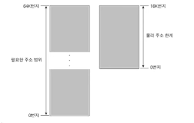
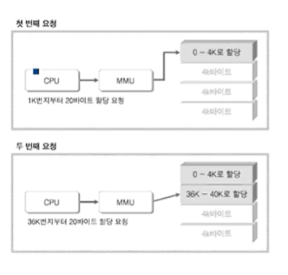
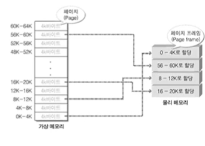
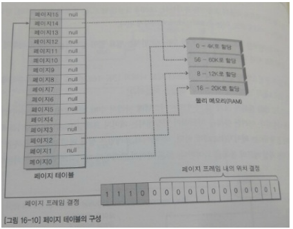
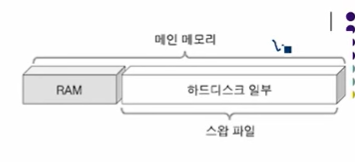
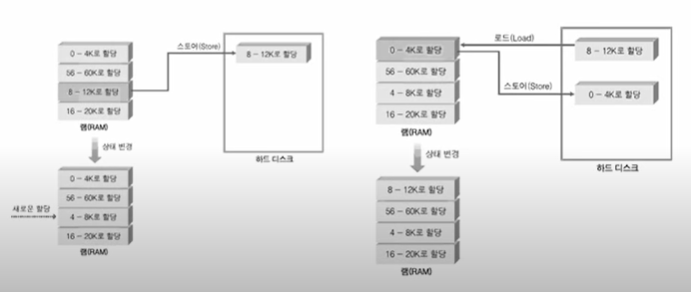

#  컴퓨터 구조에 대한 네번째 이야기

## 가상 메모리(Virtual Memory)

"메인 메모리는 512MB 인데 어떻게 프로세스에 4GB가 할당되어 프로그램이 실행되는 것인가?"

### 물리 주소(Physical Address)

범용 디스크는 하드디스크가 존재한다.
따라서 Windows 운영체제에서부터 각종 소프트웨어를 하드디스크에 저장해 놓고, 전원이 인가되면
저장된 소프트웨어를 기반으로 동작하게 된다.

반대로 임베디드 시스템은 하드디스크가 없다. 하드디스크가 없으니 가장 기본이 되는 운영체제도 
저장되어 있지 않을 것이고 때문에 전원을 넣는다고 해서 동작될 리 만무하다. 메인 메모리인 램(RAM)에다
저장해 놓으면 어떻겠는가? 이것이 하나의 해결책이 될 수 있다. 그러나 램에 저장된
데이터는 공급되던 전원이 중단되면 사라지기 때문에 시스템을 동작하기 위해서는 전원을 인가할 때마다
매번 운영체제를 다시 로딩해야만 한다. 궁극적인 해결책이 될 수 없다.

필자가 개발하는 환경에서는 이러한 임베디드 시스템의 문제점을 플래시 메모리로 보완하였다.(플래시 메모리가 
범용 컴퓨터의 하드디스크 역할을 대신하였다고 생각하면 된다.) 
즉 플래시 메모리에 데이터를 저장해놓고 전원이 인가되면 램에서 데이터가 이동하도록 디자인하였다. 
그런데 이 데이터라는 것은 컴파일이 완료된 운영체제와 그 운영체제를 바탕으로 동작하는 프로그램을 총칭하는 것이다.
임베디드 시스템의 프로그램 동작은 다음과 같은 형태로 이뤄진다. 

물리적 주소 지정을 하게 되면 CPU 입장에서는 접근 가능한 주소의 범위가 제한된다.
이것은 프로그래머가 할당할 수 있는 주소 범위가 제한적이라는 뜻도 된다. 
이렇게 주소의 범위가 제한되면 , 프로그래머는 주소 범위를 넘어서지 않도록 주의를 기울이며 개발에 임헤야 한다.
일반적으로 주소 범위의 제한 없이 프로그래밍을 해 온 여러분들은 이러한 문제를 고민해 본적이 없을 것이다. 
주소의 범위에 제한이 생긴다는 것은 프로그램 개발에 있어서 엄청난 제약사항으로 작용한다. 

지금까지 설명한 물리적 주소 지정은 우리가 쉽게 이해할 수 있는 메모리 구조이다. 메인 메모리 크기가
16MB 이면 이 범위 안에서 운영체제와 프로그램을 로딩하고 프로그램 실행 과정에서 메모리를 할당해야만  한다.

###가상 주소(Virtual Address) 시스템 1

32비트 시스템에서 프로세스 생성 시 4GB 의 메모리를 할당받을 수 있다.
그러나 메인 메모리의 크기는 여기에 턱없이 부족하다. 따라서 4GB 는 실제 존재하지 않는 가상의 주소라는
결론부터 내릴 수 있다. 이렇게 가상의 주소를 지정하는 것을 가리켜 가상 주소 지정(Virtual Addressing)이라 하며,
가상 주소 지정을 통해서 할당받게 되는 4GB를 가리켜 가상 메모리 공간이라 한다.
메인 메모리는 많은 돈을 늘려봐야 4GB 밖에 되지 않는데(물론 늘어나겠지만), 둘 이상의
프로세스에게도 각각 4GB 메모리 공간 할당이 가능하다. 무슨 요술이라도 부리는 것인가?
내면을 들여다 보면 요술도 뭐도 아니다. 그저 하나의 기술에 지나지 않는다.

상황은 이렇게 시작이 된다. 햐드디스크가 80GB이다. 비록 느리지만 애도 쓸만하다. 툭 터넣고 이야기헤서 메인 메모리의
역할을 하드디스크라 해서 못하라는 법은 없다. 그저 좀 느릴뿐이다. 
자 ! 조금 느린 하드디스크의 여유 공간이 수십 기가바이트나 되니깐 둘 이상의 프로세스에게 4GB 씩 메모리
공간을 할당해 준다고 해서 문제될 것은 없다. 단 두가지만 고려해준다면 말이다.

#### [첫 번째 문제 : 선 할당으로 인한 부담]

"프로세스를 생성할 때마다 4GB 씩 하드디스크를 할당 해줄 것인가? 아주 조그마한 Hello World~ 
프로그램을 실행시킬 때에도? 실제로 사용하는 메모리 공간은 1MB도 안 되 잖아 ! 
4GB 를 미리 할당하는 것은 메모리 낭비도 심하지만 시간도 엄청나게 걸리는 작업이야"

#### [두 번째 문제 : 느린 속도의 개선 필요성]

"하드 디스크는 너무 느려, 속도를 조금이라도 개선시켜 줬으면 좋겠어!"

지금부터 설명하는 가상 메모리 시스템을 이해하고 난 다음에 위 두문제를 어떻게 해결하고 있는지 
여러분 스스로 답을 내려보기 바란다. 적절한 답을 내리지 못한다면 2% 부족한 것이다.
위 두 문제가 해결되는 원리를 이해한다는 것은 가상 메모리 시스템에 대해서 정확히 알고 있다는 뜻이다.

가상 메모리 시스템을 구현하는 방법은 표준으로 정해져 있지 않다. 그러나 대부분의 시스템에서
페이징 이라는 기법을 사용하므로 이를 바탕으로 설명하겠다. 그리고 페이징 알고리즘의 구현방법도 다양하게
존재하는데, 우리는 구현 관점이 아니라 이해 관점에서 접근하도록 하겠다. 
우리가 살펴볼 시스템의 사양은 다음과 같다.

- 가정 1 . 16비트 시스템 , 따라서 0부터 64K-1 까지 주소 지정 가능
- 가정 2 . 프로세스별로 64K바이트 메모리 할당. 물론 가상 메모리 할당
- 가정 3 . 메인 메모리 16K바이트 , 즉 램 용량이 16K 바이트

실제 메모리는 16K 바이트가 전부인데, 프로세스를 생성할 때마다 64K바이트를 할당하고자 하니 문제가 아닐 수 없다.
특히 16K번지 이상의 메모리는 접근조차 불가능하다. 최대 할당 가능한 메모리 번지는 16K-1 번지이다.

MMU(Memory Management Unit) 이라는 녀석이 등장하였는데 , 
이 녀석은 16KB 밖에 존재하지 않는 메모리를 64KB 가 존재하는 것처럼 CPU가 느끼도록 컨트롤하는 역할을 한다.
(물론 32비트 시스템에서는 4GB 의 메모리가 존재하는 것처럼 느끼게 한다.)
위 그림에서 MMU를 CPU와 독립적인 하드웨어로 표시해 뒀지만, 실제로는 CPU와 함께 하나로 패키징 되는 장치다.
이 장치가 어떻게 동작하는지 살펴보자. CPU가 메모리로 직접 접근하지 않고 MMU를 통해서 
요청을 한다.

"MMU야 1K번지를 시작으로 20바이트를 할당하련다."

이러한 요청을 받은 MMU는 고민도 없이, 메인 메모리에서 아직 사용되지 않는 메모리 블록 하나를 골라서 할당을 한다.

위 그림은 가상 메모리와 그에 해당하는 실제 물리 메모리가 어떻게 매칭 되는지 보여준다. 
현재 가상 메모리 0K~4K는 물리 메모리의 가장 위쪽에 매핑 되어 있다.
(MMU에 의해 매핑된다. )
따라서 CPU가 0K~4K 사이에 존재하는 데이터를 요구할 경우 MMU는 매핑된 물리 메모리를 참조해서 데이터를
전송해 준다.

위 그림에서 페이지 테이블을 보자. 페이지의 크기를 4K 바이트로 정의한 경우
64K바이트의 메모리 공간에서 얻을 수 있는 총 페이지 개수는 16개이다. 페이지 0은 0K~4K 의 메모리 주소를
나타내며, 페이지1은 4K~8K의 메모리 주소를 나타낸다. 그리고 페이지 15는 60K~64K의 메모리 주소를 나타낸다.

페이지 테이블의 키는 페이지 숫자이다. 그리고 값은 해당 페이지가 존재하는 페이지 프레임의 
시작 번지이다. 이러한 테이블 구성을 지닐 경우 페이지 테이블을 참조해서
가상 주소를 실제 할당도어 있는 물리 주소로 변환할 수 있다.

### 가상 주소(Virtual Address) 시스템 2

아직 해결하지 못한 문제가 남아 있다. 바로 메모리 부족 문제이다. 
물리 메모리 할당이 이미 다 끝나버렸다면? 게다가 둘 이상의 프로세스가 실행된다면??

이 문제를 해결하기 위해서는 하드디스크가 필요하다.

앞에서도 언급했지만 하드디스크도 램과 비교해서 속도를 제외하면 그 기능에 있어서 조금도 부족함이 없는 메모리이다.
이러한 하드디스크를 메인 메모리로 확장해서 문제를 해결할 수 있다.
조금 구체적으로 말하자면 스왑 파일(Swap File)이라는 개념을 도입해서 램(RAM)에 해당하는
메인 메모리를 하드디스크까지 확장한 것이다.

수십 기가 바이트 이상의 여유 공간을 메인 메모리로 확장하여 쓸 수 있다는 사실은 아주 큰 장점이다.

