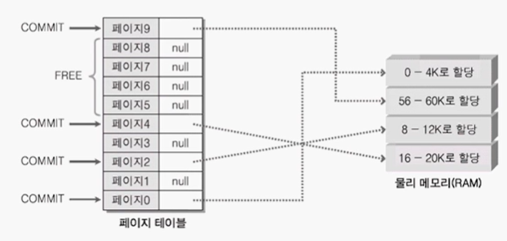

# 20장 메모리 관리(Virtual Memory , Heap ,  MMF)

## Reserve , Commit 그리고 Free

Reserve 는 예약 , Commit 은 할당, Free 는 할당되지 않았음을 의미한다. 
Windows 시스템에서 부여할 수 있도록 정의한 페이지의 상태를 의미하는 것이다.

페이지의 총 개수는 다음과 같은 공식으로 계산할 수 있다.

`가상 메모리의 크기 / 페이지 하나당 크기 = 페이지의 개수`

즉 페이지 개수는 가상 메모리의 크기에 비례하며, 모든 페이지는 Reserved , Commit , 그리고 Free 이 
세 가지중 하나의 상태를 지닌다. 

COMMIT으로 표시된 부분은 물리 메모리에 할당이 이뤄진 부분들
그리고 물리 메모리에 할당이 이뤄지지 않은 페이지를 가리켜 FREE 상태라 표현한다.

시스템이 물리 메모리 사용의 효율성을 높이기 위해서, 아주 큰 배열을 선언하면 
필요한 만큼 메모리 할당량을 조금씩 확장할 것으로 기대하는가?
그렇다면 여러분은 너무나도 많은 것을 바라는 것이다.
생각보다 시스템은 단순하다. 여러분이 페이지를 COMMIT 상태로 만들어 버리면, 해당 페이지는
물리 메모리에 할당되어 버린다. 그 위치가 RAM 이던 하드 디스크이던 간에 말이다.
이러한 상황을 고려해서 등장한 것이 RESERVE 상태이다.

FREE 상태에 있던 페이지 중에서 총 다섯 페이지를 RESERVE 상태로 변경시켰다. 
RESERVE 상태는 FREE 와 COMMIT의 중간 상태이다. 일부 페이지를 RESERVE 상태로 둠으로써 
다른 메모리 할당 함수에 의해 해당 번지가 할당되지 못하도록 선언할 수 있다. 
그러나 예약만 했을 뿐 할당이 완료된 상태가 아니므로 물리 메모리에 할당되지는 않는다.
말 그래도 예약 상태인 것이다. 때문에 물리 메모리의 소비는 발생하지 않는다. 

이것이 끝이 아니다. RESERVE 상태에 있는 메모리 중에서 일부만 COMMIT 상태로 변경하는 것도 가능하다.
따라서 메모리의  사용량이 늘어남에 따라서 점진적으로 COMMIT 상태의 페이지 개수를 증가 시킬 수 있다. 
정말 필요한 만큼의 페이지만 물리 메모리에 할당하는 것이 가능하다. 

그렇다면 프로그램 코드상에서 어떻게 RESERVE 상태의 특성을 활용할 수 있을까? 이것이
이번 장을 통해서 우리가 공부해야 할 과제이다. 좀 전에 배열과 관련해서 이야기를 하였는데,
우리의 목표는 동적으로 물리 메모리의 할당량이 증가하는 배열을 만드는 것이다. 
물론 배열 인덱스 연산이나 포인터 연산이 가능하도록 하나의 배열로 구성할 것이다 

### 메모리 할당의 시작점과 단위 확인하기

페이지 단위로 메모리를 할당하기에 앞서 알아야 할 정보가 있다.
메모리를 할당하기 전에 기본적으로 생각해야 하는 것은 다음 두가지다.

메모리 할당의 시작 주소, 할당할 메모리의 크기

가상 메모리 시스템은 페이지 단위로 관리한다. 때문에 페이지의 중간 위치에서부터 할당을 시작할 수 없으며,
페이지 크기의 배수 단위로 할당을 해야만 한다.

일단 메모리 할당의 시작 주소에 대해서 살펴보자. 페이지 크기가 4K 바이트라면 4K의 배수 값이
할당의 시작 주소가 될  수 있다. 그러나 Windows 시스템에서는 메모리가 지나치게 조각나는 것을 막기 위해서,
그리고 관리의 효율성을 이유로 하여 조금 더 넓은 범위의 값을 할당의 경계로 정의하고 있다. 
메모리 할당의 시작 주소가 될 수 있는 기본 단위를 가리켜 "Allocation Granularity Boundary"라 한다.
